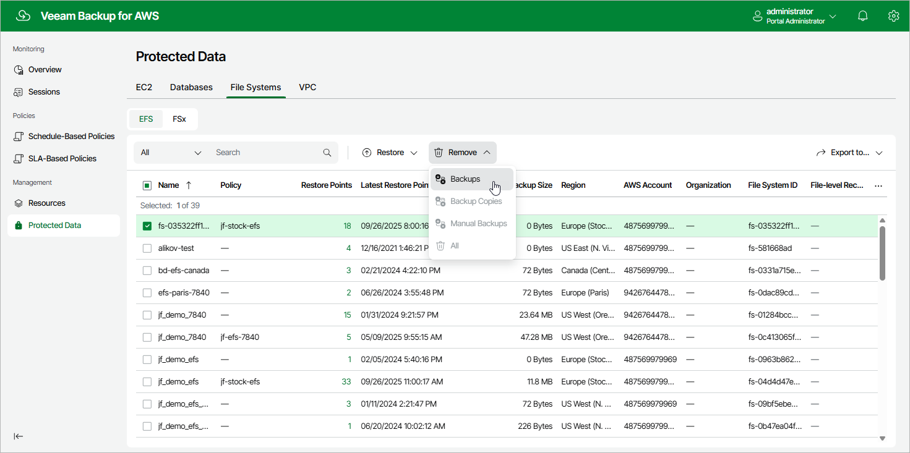

# Removing EFS Backups

The backup appliance applies the [configured retention policy settings](aws_add_policy_schedule_retention_efs.md) to automatically remove EFS file system backups and backup copies created by backup policies. If necessary, you can also remove the backed-up data manually.

To remove backed-up data manually, do the following:

1. Navigate to Protected Data > File Systems > EFS.
2. Select EFS file systems whose data you want to remove.
3. Click Remove and select either of the following options:

* Backups — to remove EFS backups created for the selected file systems by backup policies.
* Backup Copies — to remove backup copies created for the selected file systems by backup policies.
* Manual Backups — to remove EFS backups created for the selected file systems manually.

If you want to remove only specific manual backup, follow the instructions provided in section [Removing EFS Backups Created Manually](aws_backups_remove_individual_efs.md).

* All — to remove all backups and backup copies created for the selected file systems both by backup policies and manually.

Page updated 2026-05-21

