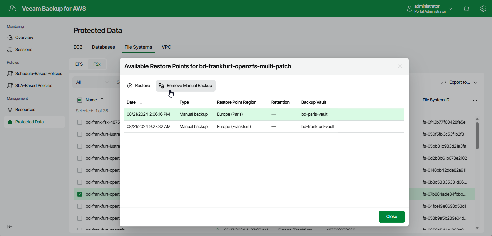

# Removing FSx Backups Created Manually

To remove all backups created for an FSx file system manually, follow the instructions provided in the
[Removing FSx Backups](aws_backups_remove_fsx.md)
section. If you want to remove a specific FSx backup created manually, do the following:

1. Navigate to
   Protected Data
    >
   File Systems
    >
   FSx
   .
2. Select the necessary file system, and click the link in the
   Restore Points
    column.
3. In the
   Available Restore Points
    window, select a backup that you want to remove, and click
   Remove Manual Backup
   .

Related Topics

* [Creating FSx Backups Manually](aws_backup_manual_fsx.md)
* [Removing FSx Backups](aws_backups_remove_fsx.md)

Page updated 2025-09-26

