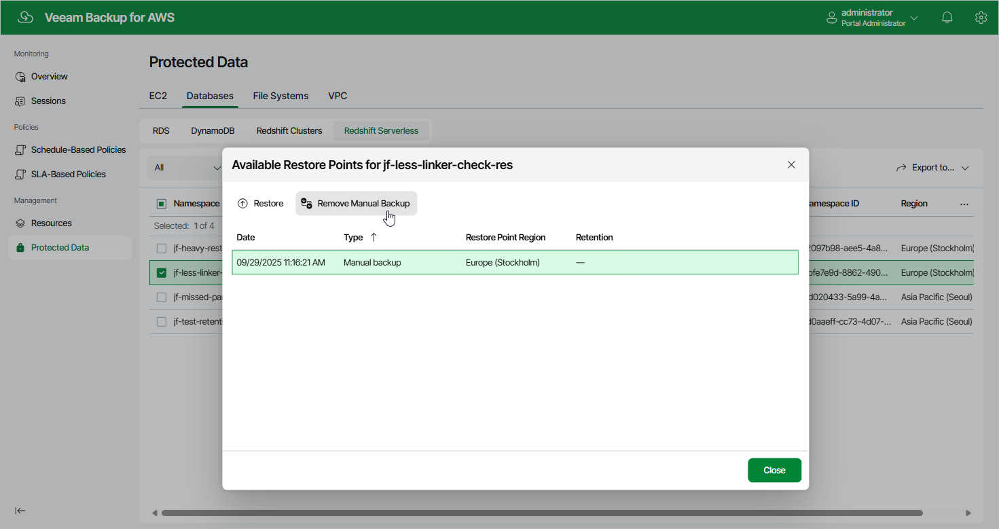

# Removing Redshift Serverless Backups Created Manually

To remove all cloud-native backups created for a Redshift Serverless namespace manually, follow the instructions provided in the
[Removing Redshift Serverless Backups](aws_backups_remove_redshift_serverless.md)
section. If you want to remove a specific backups created manually, do the following:

1. Navigate to
   Protected Data
    >
   Databases
    >
   Redshift Serverless
   .
2. Select the necessary namespace, and click the link in the
   Restore Points
    column.
3. In the
   Available Restore Points
    window, select a backup that you want to remove, and click
   Remove Manual Backup
   .

Related Topics

* [Creating Redshift Serverless Backups Manually](aws_backup_manual_redshift_serverless.md)
* [Removing Redshift Serverless Backups](aws_backups_remove_redshift_serverless.md)

Page updated 2025-09-29

