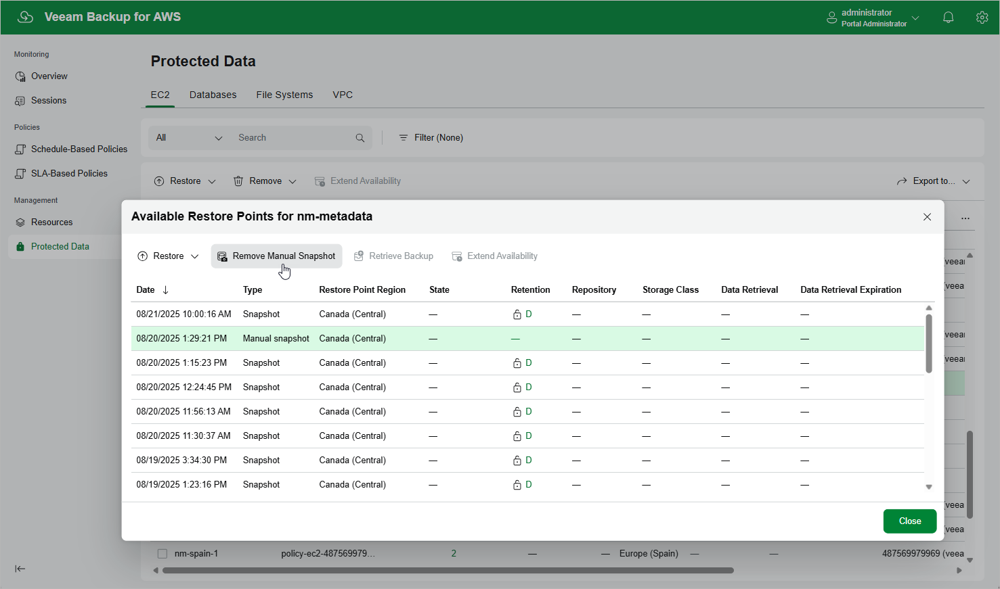

# Removing EC2 Snapshots Created Manually

To remove all cloud-native snapshots created for an EC2 instance manually, follow the instructions provided in the
[Removing EC2 Backups and Snapshots](aws_backups_remove.md)
section. If you want to remove a specific snapshot created manually, do the following:

1. Navigate to
   Protected Data
    >
   EC2
   .
2. Select the necessary instance, and click the link in the
   Restore Points
    column.
3. In the
   Available Restore Points
    window, select a snapshot that you want to remove, and click
   Remove Manual Snapshot
   .

Related Topics

* [Creating EC2 Snapshots Manually](aws_snapshot_manual.md)
* [Removing EC2 Backups and Snapshots](aws_backups_remove.md)

Page updated 2025-09-16

