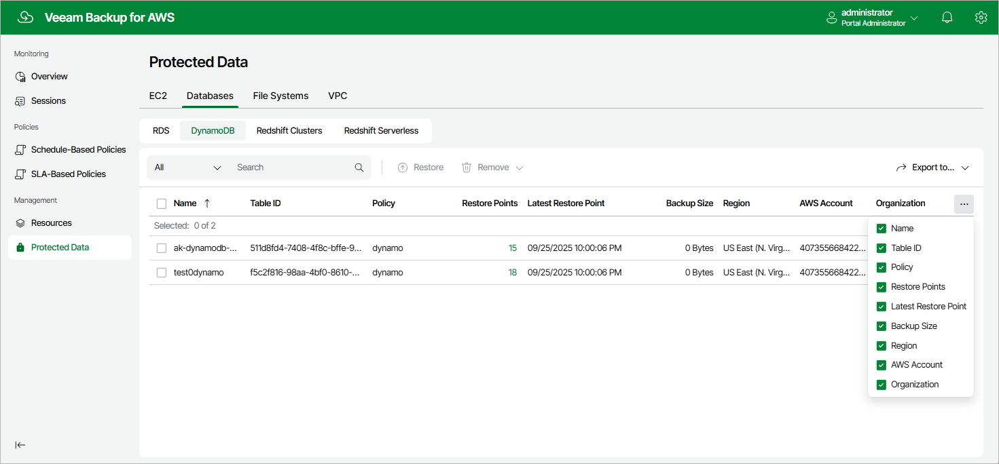

# DynamoDB Data

After a backup policy successfully creates a restore point of a DynamoDB table according to the specified schedule, or after you create a backup of a DynamoDB table manually, the backup appliance adds the table to the resource list on the Protected Data page.

For each backed-up DynamoDB table, the backup appliance creates a record in its configuration database with the following set of properties:

* Name — the name of the DynamoDB table.
* Table ID — the AWS ID of the of the DynamoDB table.
* Policy — the name of the backup policy that processed the DynamoDB table.
* Restore Points — the number of restore points created for the DynamoDB table.

To view the list of restore points, click the link in the Restore Points column. The Available Restore Points window will display information on each restore point, including the following: the date when the restore point was created, the size and type of the restore point, the backup vault where the restore point is stored, and the configured retention policy settings (D — daily, W — weekly, M — monthly or Y — yearly).

* Latest Restore Point — the date and time of the latest restore point that was created for the DynamoDB table.
* Backup Size — the size of all backups created for the DynamoDB table stored in backup vaults.
* Region — the AWS Region in which the DynamoDB table resides.

* AWS Account — the AWS account to which the DynamoDB table belong.

* Organization — the AWS Organization to which the DynamoDB table belongs.

On the Protected Data page, you can also perform the following actions:

* Remove restore points if you no longer need them. For more information, see sections [Removing DynamoDB Backups](aws_backups_remove_dynamo.md) and [Removing DynamoDB Backups Created Manually](aws_backups_remove_individual_dynamo.md).
* Restore data of backed-up DynamoDB tables. For more information, see [DynamoDB Restore Using Web UI](aws_dynamo_restore_ui.md).

Page updated 2026-05-21

