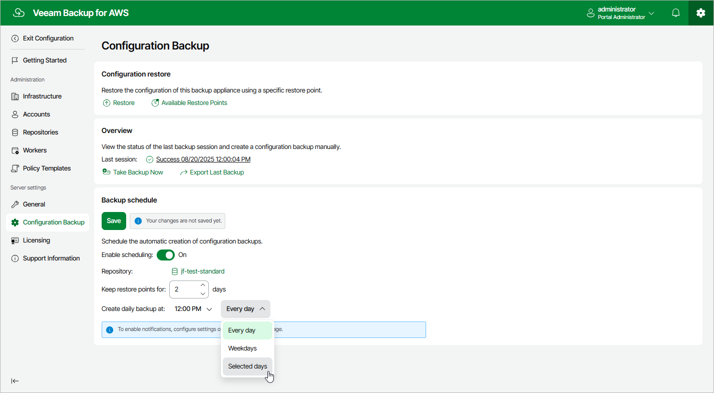

# Performing Configuration Backup Using Web UI

While performing configuration backup, backup appliances export data from appliance configuration databases and save it to a backup file in a backup repository. You can back up the configuration database of a backup appliance either manually or automatically.

|  |
| --- |
| Important |
| If your backup appliance is managed by a Veeam Backup & Replication server, you will neither be able to perform manual or scheduled configuration backup of the backup appliance from the Web UI, nor to export the configuration data from the Web UI. In this case, you can perform configuration backup using the Veeam Backup & Replication console as described in section [Performing Configuration Backup Using Console](aws_config_backup_console.md). |

Performing Configuration Backup Manually

To back up the appliance configuration database manually, do the following:

1. Switch to the Configuration page.
2. Navigate to Configuration Backup.
3. In the Overview section, click Take Backup Now.
4. In the Create Manual Backup window, select a repository where the configuration backup will be stored, and click Create.

For a backup repository to be displayed in the Repository list, it must be added to the backup appliance as described in section [Adding Backup Repositories Using Web UI](aws_repositories_add_ui.md). The Repository list shows only backup repositories of the S3 Standard storage class that have encryption enabled and immutability disabled.

As soon as you click Create, the backup appliance will start creating a new backup file in the selected repository. To track the progress, click Go to Sessions in the Session Info window to proceed to the [Sessions tab](aws_reporting.md#ui).

|  |
| --- |
| Tip |
| Once the backup appliance creates a successful configuration backup, you can click Export Last Backup to download the backup file to a local machine and then use it to [restore configuration data](aws_config_restore_web_ui.md). |

Performing Configuration Backup Automatically

To instruct the backup appliance to back up the appliance configuration database automatically by schedule, do the following:

1. Switch to the Configuration page.
2. Navigate to Configuration Backup.
3. In the Backup Schedule section, set the Enable scheduling toggle to On.
4. Click the link next to the Repository field, and select a repository where configuration backups will be stored in the Choose Repository window.

For a backup repository to be displayed in the list of available repositories, it must be added to the backup appliance as described in section [Adding Backup Repositories Using Web UI](aws_repositories_add_ui.md). The list shows only backup repositories of the S3 Standard storage class that have encryption enabled and immutability disabled.

1. In the Keep restore points for field, specify the number of days for which you want to keep restore points in a backup chain in the selected backup repository.

If a restore point is older than the specified time limit, the backup appliance removes the restore point from the backup chain.

1. In the Create daily backup at field, choose whether configuration backups will be created every day, on weekdays (Monday through Friday), or on specific days.
2. Click Save.

Page updated 2026-05-21

