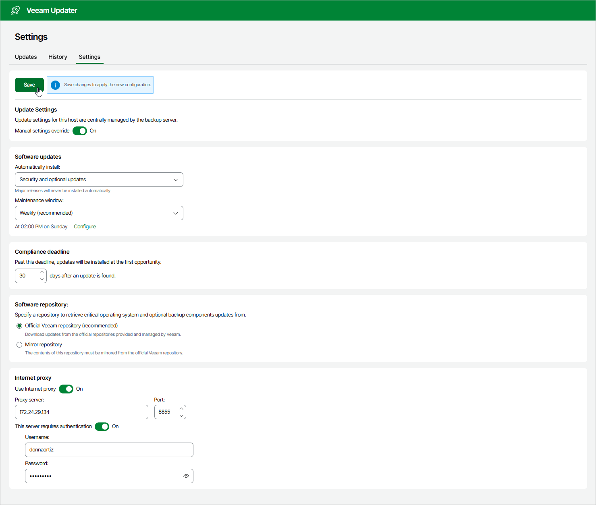

# Configuring Update Settings

To configure custom settings that the backup appliance will use to check for and install available software package updates on a regular basis, do the following:

1. Open the Veeam Updater page. To do that:

1. Switch to the Configuration page.
2. Navigate to Support Information.
3. On the Updates tab, click Check and View Updates.

1. On the Veeam Updater page, do the following:

1. Switch to the Settings tab.
2. In the Update settings section, set the Manual settings override toggle to On.
3. In the Software updates section, choose whether the backup appliance will install all software updates (including security, .NET,  PostgreSQL and other 3rd-party packages) or security updates only. Then, configure a maintenance window to choose whether you want to install these updates on a weekly or monthly basis.

|  |
| --- |
| Tip |
| If you plan to install software updates manually, select None from the Maintenance window drop-down list. Then, follow the instructions provided in section [Installing Updates](aws_updates_install.md). |

1. In the Compliance deadline section, specify a time period after which the backup appliance will force update installation — as soon as this period is over, the the updates will be installed regardless of the configured maintenance window. The maximum deadline is 90 days.
2. In the Software repository section, choose whether you want to download updates from official Veeam repositories or from a server that hosts your own local copy of these repositories. In the latter case, you must also specify the server URL and upload a self-signed certificate (if necessary).

Keep in mind that to allow the backup appliance to access the repositories, you must open a number of ports required for outbound internet access. For more information, see [Ports](aws_ports.md).

1. If the backup appliance has no direct internet access, configure an HTTP proxy to allow the Veeam Updater service to access the required resources. To do that:

1. In the Internet proxy section, set the Use HTTP Internet proxy toggle to On.
2. In the Proxy server field, enter the IP address or FQDN of the proxy.
3. In the Port field, enter the port used on the proxy for HTTP connections.
4. If the HTTP proxy requires authentication, set the This server requires authentication toggle to On. Then, specify credentials of the user account configured on the proxy to access the internet.

|  |
| --- |
| Important |
| Accessing resources through HTTPS proxies is not supported. |

1. Click Save.

Page updated 2026-07-17

