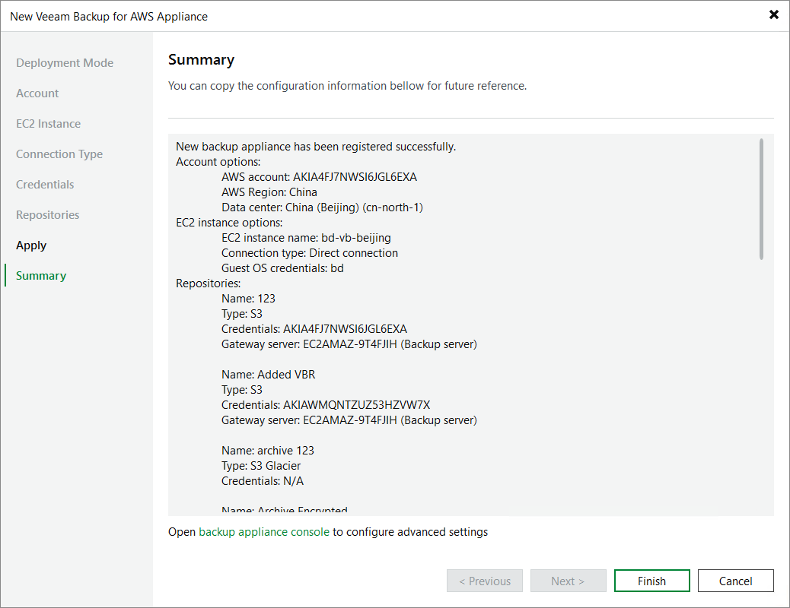

# Step 9. Finish Working with Wizard

At the Summary step of the wizard, review configuration information and click Finish.

After the backup appliance is added to the backup infrastructure, you can configure its settings in the backup appliance Web UI as described in section [Configuring Veeam Plug-in for AWS](aws_configuration.md). If you want Veeam Backup & Replication to open the Web UI of the added backup appliance immediately, click the backup appliance console link.

Page updated 2026-06-30

