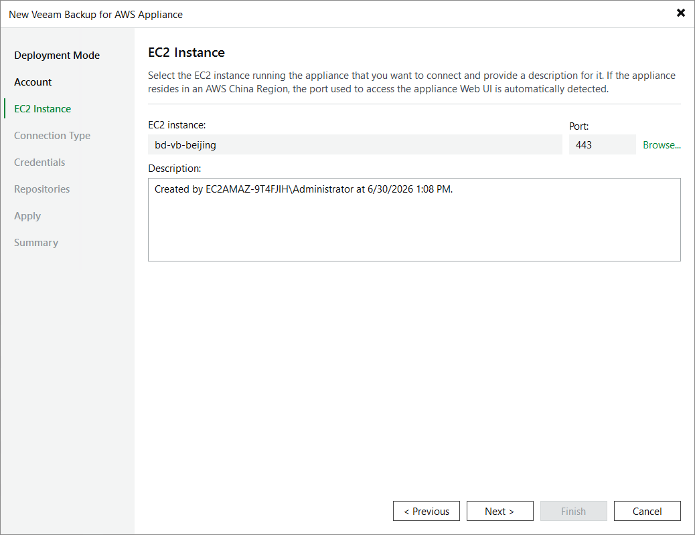

# Step 4. Select Appliance

At the EC2 Instance step of the wizard, choose the EC2 instance running the backup appliance and provide a description for future reference. For the EC2 instance to be displayed in the list of available instances, it must belong to the same AWS account as the IAM user specified at [step 3](aws_connect_appliance_account.md) of the wizard.

|  |
| --- |
| Note |
| If the selected appliance resides in an AWS China Region, Veeam Backup & Replication will automatically display the port that is used to access the appliance Web UI — but you will not be able to change this port. |

Page updated 2026-06-30

