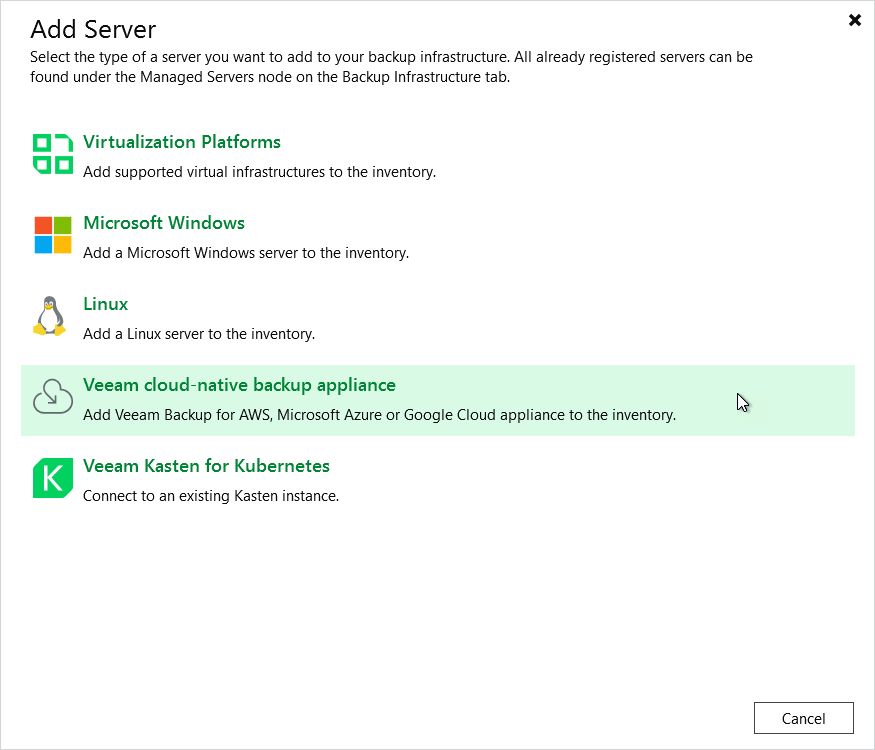

# Step 1. Launch New Veeam Backup for AWS Appliance Wizard

To launch the New Veeam Backup for AWS Appliance wizard, do one of the following:

1. In the Veeam Backup & Replication console, open the Backup Infrastructure view.
2. Navigate to Managed Servers and click Add Server on the ribbon.

Alternatively, you can right-click the Managed Servers node and select Add Server.

1. In the Add Server window, click Veeam cloud-native backup appliance and select the Veeam Backup for AWS option.

Page updated 2026-06-04

