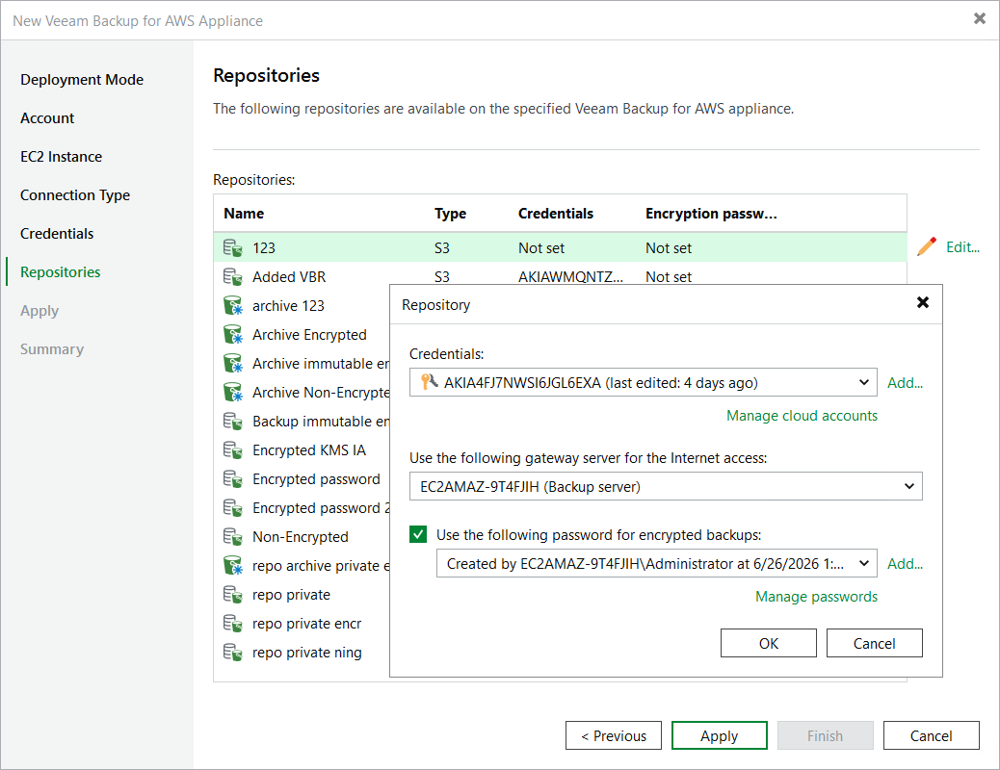

# Step 7. Configure Repository Settings

At the Repositories step of the wizard, a list of all repositories already configured on the selected backup appliance will be displayed. After you complete the wizard, Veeam Backup & Replication will automatically add these repositories to the backup infrastructure.

You can specify the following configuration settings for each repository whose restore points you want to use to recover backed-up data:

|  |
| --- |
| Note |
| The following procedure applies only to standard repositories. For archive backup repositories, there is no possibility to specify any configuration settings. |

1. In the Repositories list, select the necessary repository and click Edit.
2. In the Repository window:

1. [Applies only to backup repositories] From the Credentials drop-down list, select access keys of an IAM user whose permissions will be used to access the backup repository. For more information on the required permissions, see [Plug-in Permissions](aws_req_permissions.md#add_repository).

For access keys of an IAM user to be displayed in the Credentials list, they must be added to the Cloud Credentials Manager as described in section [Access Keys for AWS Users](cloud_credentials_aws.md). If you have not added the necessary keys to the Cloud Credentials Manager beforehand, you can do it without closing the Repository window. To do that, click either the Manage accounts link or the Add button, and specify the access and secret key in the Credentials window.

|  |
| --- |
| Note |
| If you do not specify access keys of an IAM user for a standard backup repository, you will only be able to use the Veeam Backup & Replication console to perform [entire EC2 instance restore](aws_restoring_to_amazon.md), [RDS restore](aws_rds_restore_console.md) and [EFS file systems](aws_efs_restore_console.md) restore from image-level backups stored in this repository. Moreover, information on the repository displayed in the Backup Infrastructure view under the External Repositories node will not include statistics on the amount of storage space that is currently consumed by restore points created by the backup appliance. |

1. [Applies only to storage vaults] Register the backup server in Veeam Data Cloud Vault — to do that, click Authorize. Then, specify credentials of a Veeam account that will be used to access the storage vault and click Log in in the opened authentication window.

Make sure that the storage vault is assigned to this backup server. For more information, see the Veeam Data Cloud User Guide, section [Managing Storage Vaults](https://helpcenter.veeam.com/docs/vdc/userguide/vault_storage_vaults_edit.html#assigning-storage-vaults-to-workloads).

|  |
| --- |
| Notes |
| * If you have storage vaults from different Veeam Data Cloud organizations, you will not be able to provide access to all these vaults — Veeam Backup & Replication can only access storage vaults from the same organization. * If you do not register the backup server in Veeam Data Cloud and do not assign the storage vault to this backup server, you will only be able to use the Veeam Backup & Replication console to perform [entire EC2 instance restore](aws_restoring_to_amazon.md), [RDS restore](aws_rds_restore_console.md) and [EFS file systems restore](aws_efs_restore_console.md) from image-level backups stored in this repository. Moreover, information on the repository displayed in the Backup Infrastructure view under the External Repositories node will not include statistics on the amount of storage space that is currently consumed by restore points created by the backup appliance. |

1. From the Use the following gateway server for the Internet access drop-down list, select a gateway server that will be used to provide access to the repository.

For a gateway server to be displayed in the Use the following gateway server for the Internet access drop-down list, it must be added to the backup infrastructure. For more information on gateway servers, see [Solution Architecture](aws_overview.md).

1. If encryption is enabled for the repository, the following scenarios may apply:

* If data in the repository is encrypted using a password, select the Use the following password for encrypted backups check box. From the drop-down list, select the password that is used to encrypt data. Veeam Backup & Replication will use the specified password to decrypt backup files stored in this repository.

For a password to be displayed in the Use the following password for encrypted backups drop-down list, it must be added to the Password Manager as described in section [Creating Passwords](password_manager_create.md). If you have not added the necessary password beforehand, you can do it without closing the Repository window. To do that, click either the Manage accounts link or the Add button, and specify the password and hint in the Password window.

|  |
| --- |
| Note |
| If you do not specify a password for a standard backup repository with encryption enabled, you will have to decrypt data stored in this repository manually as described in section [Managing Backed-Up Data Using Console](aws_managing_data_console.md#decrypt_backups). |

* [Applies only to backup repositories] If data in the repository is encrypted with a KMS key, Veeam Backup & Replication will automatically display the used KMS key in the Perform AWS encryption with the following KMS key drop-down list — but you will not be able to change this key.

For Veeam Backup & Replication to be able to decrypt data stored in the repository, the IAM user whose permissions will be used to access the repository must also have permissions to access KMS keys. For more information on the required permissions, see [Plug-in Permissions](aws_req_permissions.md#kms_permissions).

After you finish working with the wizard, all the configured repositories will be displayed in the Backup Infrastructure view under the External Repositories node.

|  |
| --- |
| Notes |
| * If some of the repositories are already added to the backup infrastructure of another backup server, you will be prompted to claim the ownership of these repositories. To learn how to claim the ownership, see [Ownership](external_repository_ownership.md). * After you finish adding your backup appliance to the backup infrastructure, the backup server will become the owner of the configured repositories. As a result, Veeam Backup & Replication will prioritize retention settings configured for the backup server over retention settings configured for backup policies. To learn how Veeam Backup & Replication handles retention policies, see [Managing Retention Policy](external_repository_retention.md). |

Related Topics

[Managing Backed-Up Data Using Console](aws_managing_data_console.md)

Page updated 2026-07-17

