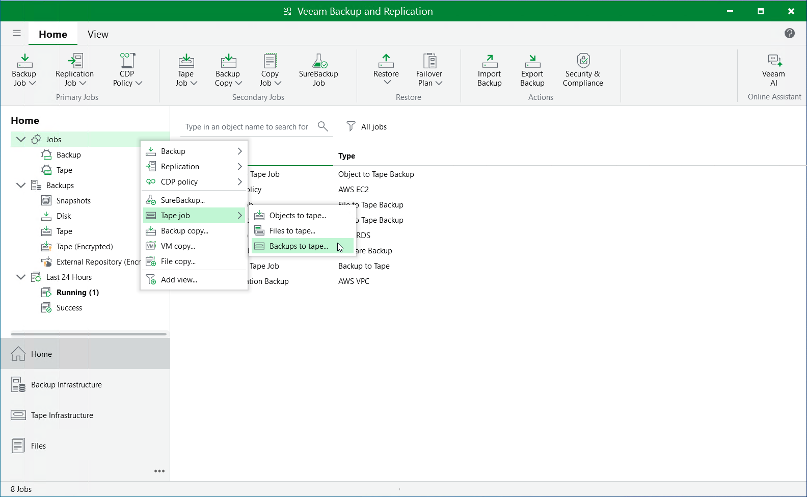

# Copying Backups to Tapes

Veeam Backup & Replication
allows you to automate copying of image-level backups of EC2 instances to tape devices and lets you specify scheduling, archiving and media automation options. For more information on supported tape libraries, see the
Veeam Backup & Replication
User Guide, section
[Tape Devices Support](tape_device_support.md)
.

Before you start copying backup to tapes:

* Copy EC2 instance backups to on-premises backup repositories. To learn how to copy backups, see the instructions provided in
  [Creating Backup Copy Jobs](aws_backup_copy.md)
  .
* Connect tape devices to
  Veeam Backup & Replication
   as described in the
  Veeam Backup & Replication
   User Guide, section
  [Tape Devices Deployment](tape_deployment.md)
  .
* Configure the tape infrastructure as described in steps 1–3 in the
  Veeam Backup & Replication
   User Guide, section
  [Getting Started with Tapes](getting_started_with_tapes.md)
  .

To copy EC2 instance backups to tapes, create a backup to tape job as described in the
Veeam Backup & Replication
User Guide, section
[Creating Backup to Tape Jobs](creating_backup_to_tape_jobs.md)
.

Page updated 2025-08-08

