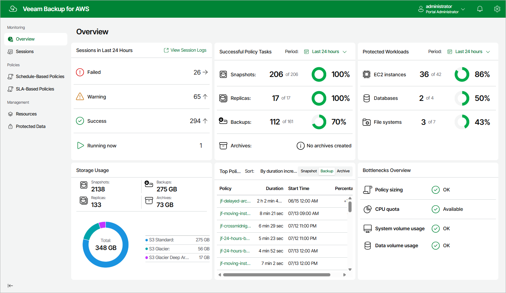

# Viewing Dashboard

Veeam Plug-in for AWS comes with an Overview dashboard that provides at-a-glance real-time overview of the protected AWS resources and allows you to estimate the overall backup performance. The dashboard includes the following widgets:

* Sessions in Last 24 Hours — displays the number of sessions started for data protection or disaster recovery operations during the past 24 hours that completed successfully, the number of sessions that completed with warnings, the number of sessions that completed with errors, and the number of sessions that are currently running.

To get more information on the sessions, click either View Session Logs or any of the widget rows. In the latter case, the Session Logs page will show only those sessions that have the same status as that clicked in the widget.

For more information on the Session Logs page, see [Viewing Session Statistics](aws_reporting.md).

* Successful Policy Tasks — displays the number of snapshots, snapshot replicas, backups and archived backups successfully created by backup policies during a specific time period (the past 24 hours by default).

To specify the time period, click the link next to the Schedule icon. To get more information on the created snapshots, backups or archived backups, click any of the widget rows. In the latter case, the Session Logs page will show only those sessions during which the backup appliance created the same items as that clicked in the widget.

For more information on the Session Logs page, see [Viewing Session Statistics](aws_reporting.md).

* Protected Workloads — displays the number of AWS resources that got protected by the backup appliance during a specific time period (the past 24 hours by default).

To specify the time period, click the link next to the Schedule icon. To get more information on the protected resources, click any of the widget rows.

For more information on the available resources, their properties and the actions you can perform for the resources, see [Viewing Available Resources](aws_aws_resources.md).

* Storage Usage — displays the amount of storage space that is currently consumed by restore points created by the backup appliance in Amazon S3 buckets. The widget also displays the total amount of storage space used in the S3 Standard, S3 Glacier Flexible Retrieval and S3 Glacier Deep Archive storage classes explicitly.
* Top Policies — shows top backup policies for execution time (including retries). For each policy, the widget also calculates the growth rate to detect whether it took less or more time for the policy to complete in comparison with the previous policy run.
* Bottlenecks Overview — is designed to help you avoid possible backup bottlenecks.

The Policy sizing widget verifies whether the appliance CPU and memory resources are enough to process all enabled backup policies and whether the backup policies are sized correctly. Note that one backup policy should not protect more than 250 resources for the backup appliance to work properly.

The CPU quota widget analyzes the amount of CPU quota across all regions to detect whether the quota has already been reached in any of the regions, and if the backup appliance could not deploy a worker instance in that region during a backup or restore process. For more information on worker profiles, see [Managing Worker Profiles](aws_worker_profiles.md).

The System volume usage widget analyzes free space on the system volume attached to the backup appliance and displays a warning if free space keeps breaching the preconfigured threshold (80%) for 60 minutes in a row. If free space is running low, open a [support case](aws_logs.md) to remove unnecessary data from the system volume.

The Data volume usage widget analyzes free space on the data volume where the backup appliance stores its configuration database and displays a warning when data volume usage reaches 85%. If free space is running low, increase the data volume size as described in [Appendix G. Increasing Volume Size of Backup Appliance](aws_increase_volume_size.md).

|  |
| --- |
| Tip |
| To prevent occasional runtime issues caused by multiple concurrent operations running on the backup appliance, you can allow the system to allocate additional resources in case of memory shortage. For more information, see [Appendix D. Enabling Swap Partition](aws_enable_swap_partition.md). |

Page updated 2026-07-13

