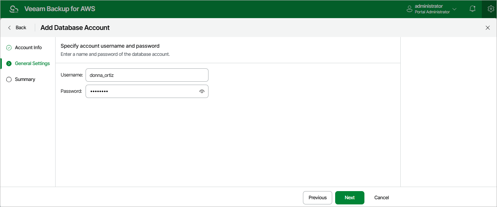

# Step 3. Specify General Settings

At the
General Settings
step of the wizard, specify credentials that the account will use to access databases protected by backup policies.

Page updated 2025-08-20

