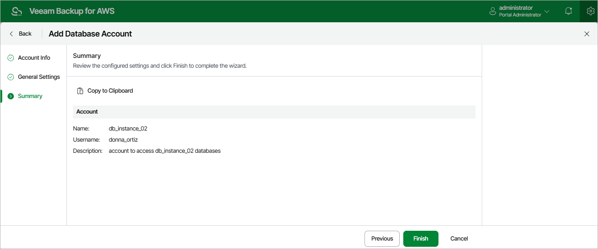

# Step 4. Finish Working with Wizard

At the Summary step of the wizard, review configuration information and click Finish.

|  |
| --- |
| Tip |
| After you add the database account, you will be able to specify this account while creating backup policies to allow the backup appliance to access source databases. For more information, see [Performing RDS Backup](aws_add_policy_processing_settings_rds.md). |

Page updated 2026-06-03

