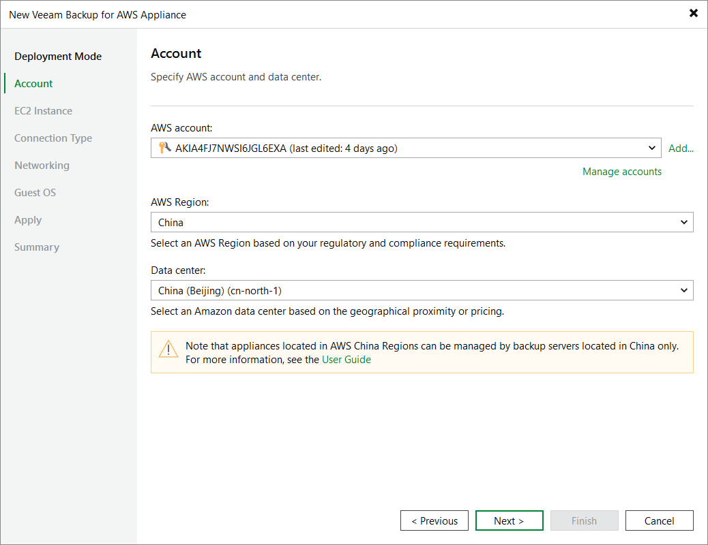

# Step 3. Specify AWS Account

At the Account step of the wizard, do the following:

1. From the AWS account drop-down list, select [access keys of an IAM user](https://docs.aws.amazon.com/IAM/latest/UserGuide/id_credentials_access-keys.html) that belongs to an AWS account in which the backup appliance will reside. Veeam Backup & Replication will use permissions of the specified IAM user to deploy the backup appliance, and further to connect to this appliance. For more information on the required permissions, see [Plug-in Permissions](aws_req_permissions.md).

For access keys of an IAM user to be displayed in the AWS account drop-down list, the keys must be created in AWS and added to the Cloud Credentials Manager as described in section [Access Keys for AWS Users](cloud_credentials_aws.md). If you have not added the necessary keys to the Cloud Credentials Manager beforehand, you can do it without closing the New Veeam Backup for AWS Appliance wizard. To do that, click either the Manage accounts link or the Add button, and specify the access key and secret key in the Credentials window.

1. From the AWS Region drop-down list, specify an AWS partition where the backup appliance will reside; it can be either AWS Global Regions, AWS China Regions or AWS GovCloud (US) Regions.

1. From the Data center drop-down list, select an AWS Region where you want to deploy the backup appliance.

For more information on regions and availability zones, see [AWS Documentation](https://aws.amazon.com/about-aws/global-infrastructure/regions_az/?nc1=h_ls).

|  |
| --- |
| Important |
| * If you choose to deploy the backup appliance in an AWS China Region, it is strongly recommended that the backup server that will be used to manage this appliance is located in China as well. * To verify region availability, Veeam Backup & Replication establishes a temporary test connection with the US East (N. Virginia) region using endpoints of the [AWS Security Token Service (STS)](https://docs.aws.amazon.com/general/latest/gr/sts.html) and [Amazon Elastic Compute Cloud (EC2)](https://docs.aws.amazon.com/general/latest/gr/ec2-service.html) services. That is why the backup server must have access to this AWS Region. If you want to change the default region for a test connection, open a [support case](aws_logs.md). |

Page updated 2026-06-30

