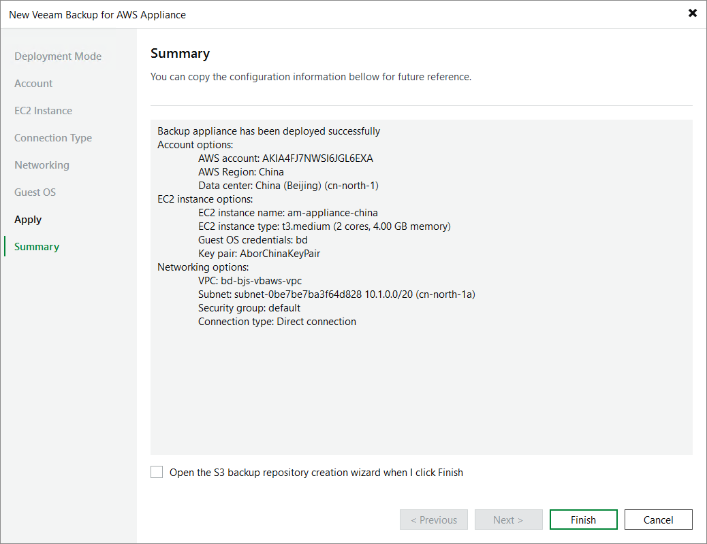

# Step 9. Finish Working with Wizard

At the Summary step of the wizard, review summary information and click Finish. After the backup appliance is deployed, you will be able to configure its settings in the backup appliance Web UI as described in section [Configuring Veeam Plug-in for AWS](aws_configuration.md).

|  |
| --- |
| Tip |
| If you want to add repositories immediately after the backup appliance is deployed, select the Open the S3 backup repository creation wizard when I click Finish check box and follow the instructions provided in section [Adding Backup Repositories Using Console](aws_repositories_add_console.md). |

Page updated 2026-06-30

