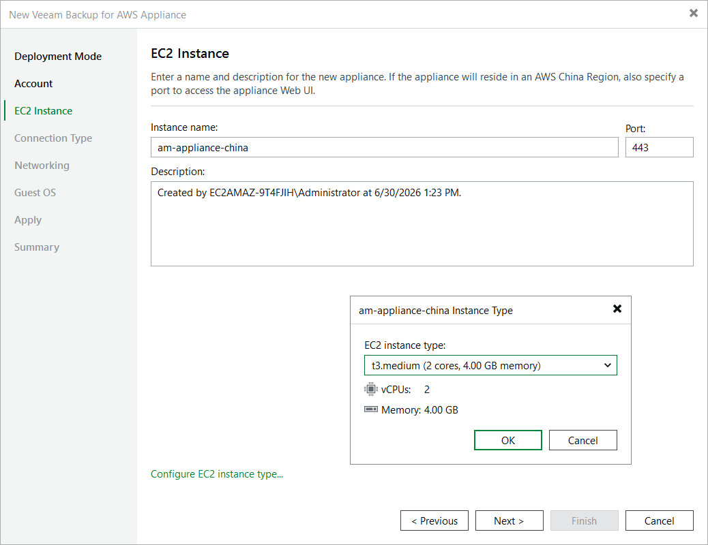

# Step 4. Specify EC2 Instance Name and Description

At the EC2 Instance step of the wizard, enter a name and provide a description for the EC2 instance where the backup appliance will be deployed.

|  |
| --- |
| Tips |
| * [Applies only if you deploy the backup appliance in an AWS China Region] By default, Veeam Backup & Replication uses port 443 to access the Web UI of the backup appliance. To specify a custom port, use the Port field. * By default, Veeam Backup & Replication uses the minimum recommended t3.medium EC2 instance type for the backup appliance. To choose a specific machine type for the EC2 instance, click Configure EC2 instance type and select the necessary type in the Instance Type window.   For the list of recommended EC2 instance types, see [Sizing and Scalability Guidelines](aws_appliance_aws.md). |

Page updated 2026-06-30

