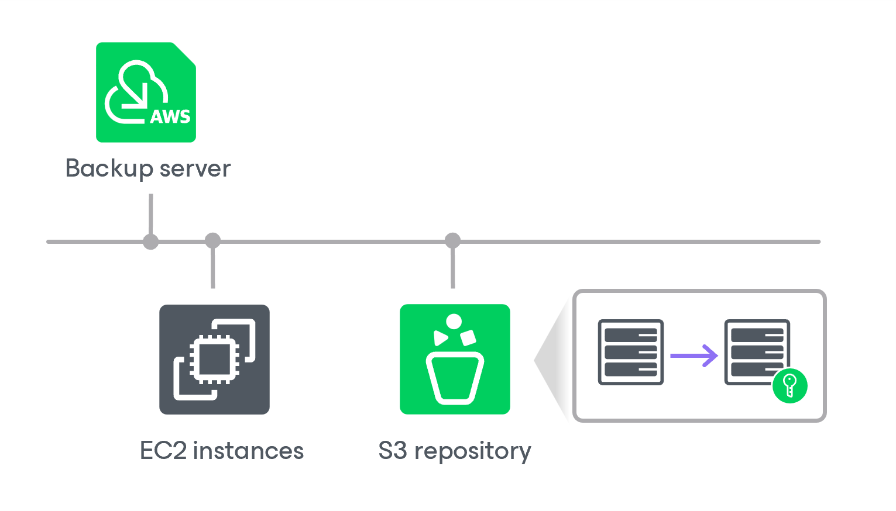

# Backup Repository Encryption

Veeam Plug-in for AWS allows you to enable encryption at the repository level. Backup appliances encrypts backup files stored in backup repositories the same way as Veeam Backup & Replication encrypts backup files stored in backup repositories. To learn what algorithms Veeam Backup & Replication uses to encrypt backup files, see [Data Encryption](data_encryption.md).

To enable encryption for a backup repository added to a backup appliance, configure the repository settings as described in section [Adding Backup Repositories](aws_repositories_add_encryption.md) and choose whether you want to encrypt data using a password or using a KMS encryption key. After you create a backup policy and specify the backup repository as a target location for backed-up data as described in sections [Creating EC2 Backup Policies](aws_policies_create.md), [Creating RDS Backup Policies](aws_policies_create_rds.md), [Creating EFS Backup Policies](aws_policies_create_efs.md) and [Editing VPC Configuration Backup Policy](aws_policies_edit_vpc.md), the backup appliance performs the following steps:

1. Based on the provided password or KMS key, generates an encryption key to protect backed-up data stored in the backup repository, and stores the key in the configuration database on the backup appliance.
2. Uses the generated key to encrypt backed-up data transferred to the backup repository when running the backup policy.

Page updated 2026-05-21

