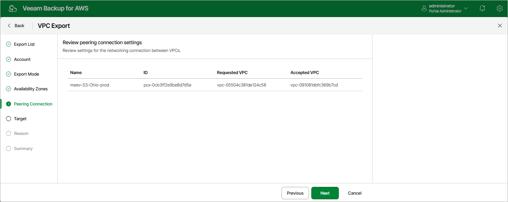

# Step 6. Review Peering Connection Settings

[This step applies only if you have selected the Export to a new location option at the Export Mode step of the wizard]

At the Peering Connection step of the wizard, review VPC peering connection settings. You cannot modify the VPC peering connection settings for the exported VPC. By default, the backup appliance will export VPC peering connections as follows:

* If you export both VPCs between which you have created a peering connection, the backup appliance will create a peering connection between the exported VPCs in the target AWS Region.
* If you export a VPC that has a peering connection to a VPC in the same AWS Region, the backup appliance will create an inter-region peering connection between the exported VPC in the target AWS Region and the VPC with which the source VPC is peered in the source AWS Region.
* If you export a VPC that has a peering connection to a VPC in another AWS Region, the backup appliance will create an inter-region peering connection between the exported VPC in the target AWS Region and the VPC with which the source VPC is peered in the other AWS Region.

|  |
| --- |
| Note |
| VPC peering connections will have the Pending Acceptance status after restoring from the exported CloudFormation template. To accept the restored VPC peering connections, use the AWS Management Console. For more information, see [AWS Documentation](https://docs.aws.amazon.com/vpc/latest/peering/create-vpc-peering-connection.html). |

Page updated 2026-05-21

