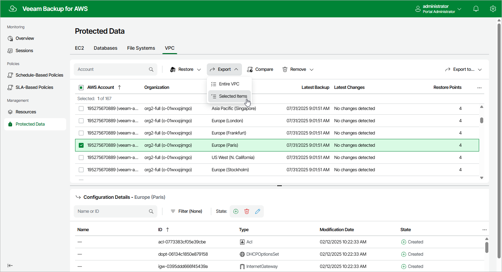

# Step 1. Launch VPC Export Wizard

To launch the
VPC Export
wizard, do the following.

1. Navigate to
   Protected Data
    >
   VPC
   .
2. Select the configuration record for an AWS Region whose VPC configuration you want to restore.
3. Click
   Export
    >
   Selected items
   .

Page updated 2025-09-29

