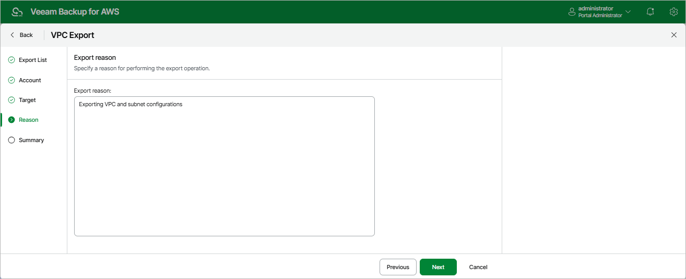

# Step 5. Specify Export Reason

At the
Reason
step of the wizard, specify a reason for the export of the VPC configuration items. The information you provide will be saved in the session history and you can reference it later.

Page updated 2025-09-29

