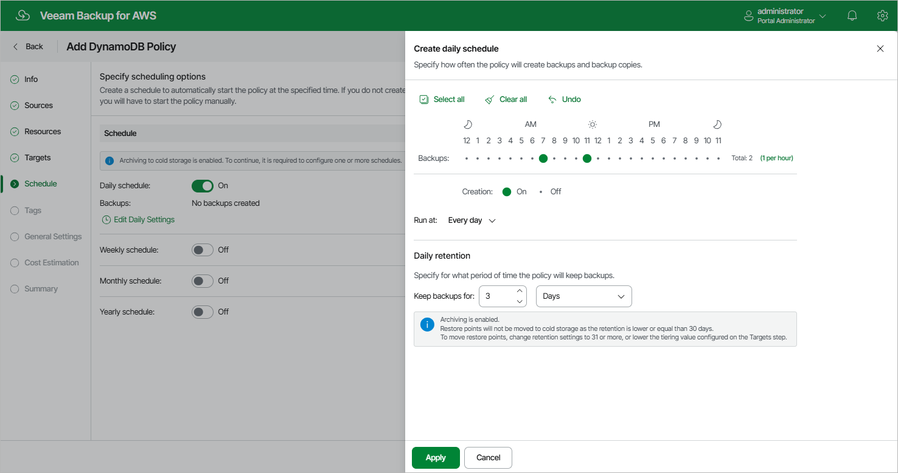
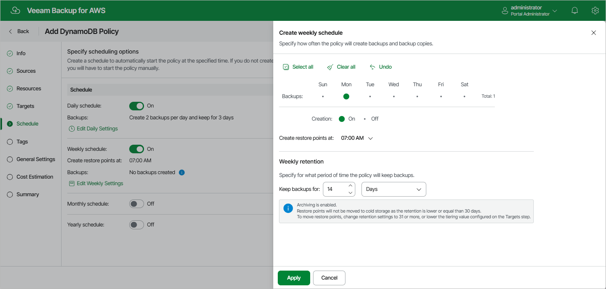
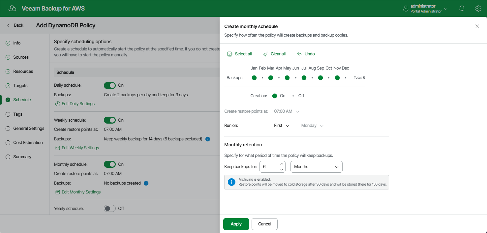
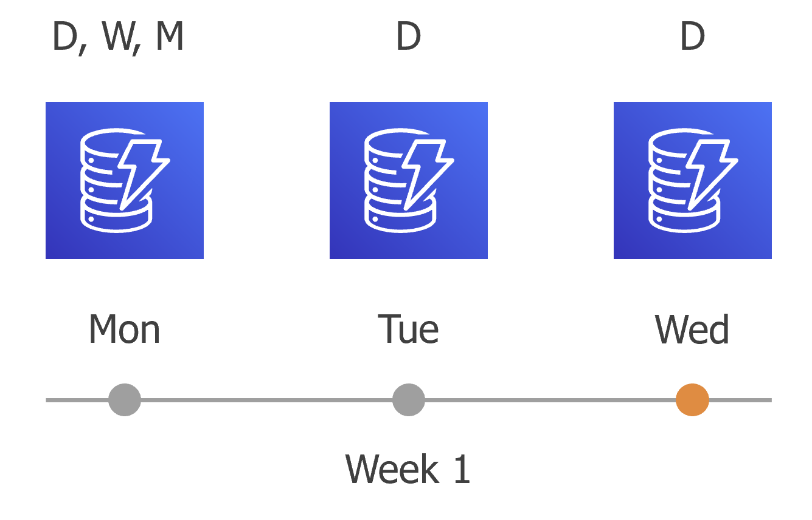
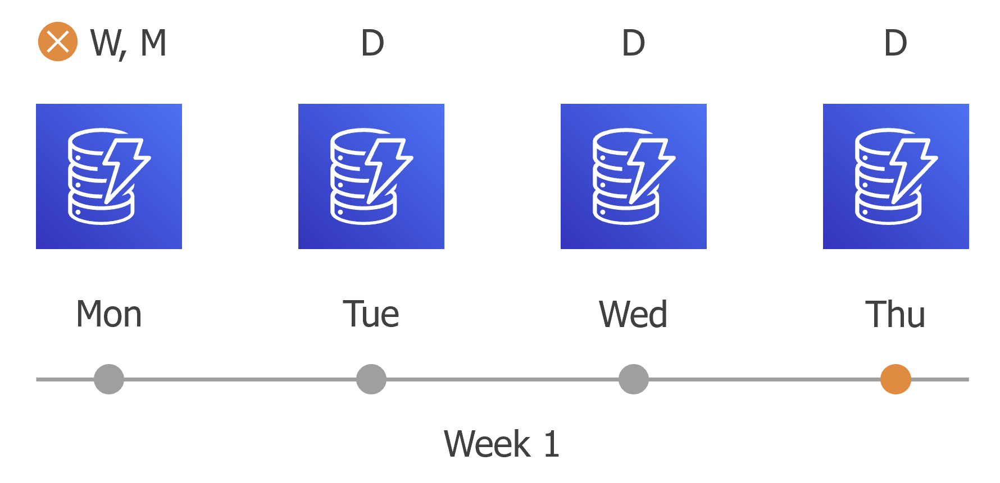
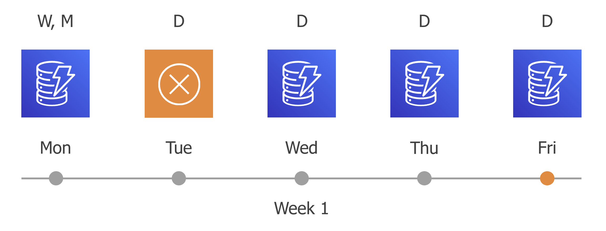
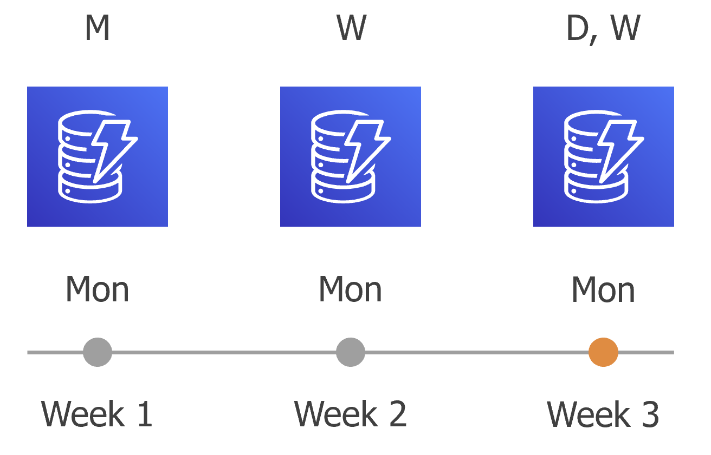

# Enabling Harmonized Scheduling

When you combine multiple types of schedules, the backup appliance applies the harmonization mechanism that allows you to leverage restore points for long-term retentions instead of taking a new restore point every time. The mechanism simplifies the backup schedule, optimizes the backup performance and reduces the cost of retaining restore points.

With harmonized scheduling, the backup appliance can keep restore points created according to a daily, weekly or monthly schedule for longer periods of time: DynamoDB backups and backup copies can be kept for weeks, months and years.

For the backup appliance to use the harmonization mechanism, there must be specified at least 2 different schedules: one schedule will control the regular creation of restore points, while another schedule will control the process of storing restore points. In terms of harmonized scheduling, the backup appliance re-uses restore points created according to a more-frequent schedule (daily, weekly or monthly) to achieve the desired retention for less-frequent schedules (weekly, monthly and yearly). Each restore point is marked with a flag of the related schedule type: the (D) flag is used to mark restore points created daily, (W) — weekly, (M) — monthly, and (Y) — yearly. The backup appliance uses these flags to control the retention period for the created restore points. Once a flag of a less-frequent schedule is assigned to a restore point, this restore point can no longer be removed — it is kept for the period defined in the retention settings. When the specified retention period is over, the flag is unassigned from the restore point. If the restore point does not have any other flags assigned, it is removed according to the retention settings of a more-frequent schedule.

Consider the following example. You want a backup policy to create backups of a DynamoDB table 2 times a day, to keep daily backups in the backup chain for 3 days, and also to retain one of the created backups for 2 weeks. Since you plan to access the weekly backups infrequently, you want to move one of these backups to a cold storage tier and retain it there for 6 months. In this case, you create 3 schedules when configuring the backup policy settings — daily, weekly and monthly:

Consider the following example. You want a backup policy to create backups of a DynamoDB table 2 times a day, to keep daily backups in the backup chain for 3 days, and also to retain one of the created backups for 2 weeks. Since you plan to access the weekly backups infrequently, you want to move one of these backups to a cold storage tier and retain it for 6 months. In this case, you create 3 schedules when configuring the backup policy settings — daily, weekly and monthly:

1. In the policy target settings, set the Enable cold storage toggle to On and instruct the backup appliance to keep backups in a warm storage tier for 30 days before moving them to the cold storage tier. During this period, you will be able to perform restore from a backup stored in the high-available warm storage.
2. In the daily scheduling settings, you select hours and days when backups will be created (for example, 7:00 AM and 11:00 AM; Every Day), and specify a number of days for which you want to keep daily restore points in a backup chain (for example, 3). The backup appliance will propagate these settings to the less-frequent schedules (which are the weekly and monthly schedules in our example).

Since you want to retain backups in the backup chain for only 3 days while instructing the backup appliance to move them to the cold storage tier after 30 days, the restore points created by the daily schedule will not be moved from the warm storage tier.

* In the weekly scheduling settings, you specify which one of the backups created by the daily schedule will be retained for a longer period, and choose for how long you want to keep the selected backup. For example, if you want to keep the daily restore point created on Monday for 2 weeks, you select 7:00 AM, Monday and specify 14 days to keep in the weekly scheduling settings.

Since you want to retain backups in the backup chain for only 14 days while instructing the backup appliance to move them to the cold storage tier after 30 days, the restore points created by the weekly schedule will not be moved from the warm storage tier.

* In the monthly scheduling settings, you specify which one of the backups created by the weekly schedule will be retained for a longer period, and choose for how long you want to keep the selected backup. For example, January, March, May, July, September, November, 6 months and First Monday.

Since you want to retain backups in the backup chain for the full 6 months while instructing the backup appliance to move them to the cold storage tier after 30 days, the restore points created by the monthly schedule will be moved from the warm storage tier.

According to the specified scheduling settings, the backup appliance will create DynamoDB backups in the following way:

1. On the first work day (Monday), a backup session will start at 7:00 AM to create the first restore point. The restore point will be marked with the (D) flag as it was created according to the daily schedule.

Since 7:00 AM, Monday is specified in weekly and monthly scheduling settings, the backup appliance will also assign the (W, M) flags to this restore point. As a result, 3 flags (D, W, M) will be assigned to the restore point.

1. On the same week, after starting the next backup sessions, the created restore points will be marked with the (D) flag.

1. On the fourth work day (Thursday), after a backup session runs at 7:00 AM, the created restore point will be marked with the (D) flag.

By this moment, the earliest restore point in the backup chain will get older than the specified retention limit. However, the backup appliance will not remove the earliest restore point (7:00 AM, Monday) with the (D) flag from the backup chain as this restore point is also marked with a flag of a less-frequent schedule. Instead, the backup appliance will unassign the (D) flag from the restore point. This restore point will be kept for the retention period specified in the weekly scheduling settings (that is, for 2 weeks).

1. On the fifth working day (Friday), after a backup session runs at 7:00 AM, the created restore point will be marked with the (D) flag.

By this moment, the restore point created on Tuesday with the (D) flag will get older than the specified retention limit. The backup appliance will remove from the backup chain the restore point created at 7:00 AM on Tuesday as no flags of a less-frequent schedule are assigned to this restore point.

1. The backup appliance will continue creating restore points for the next week in the same way as described in steps 1–4.
2. On week 3, after a backup session runs at 7:00 AM on Monday, the earliest weekly restore point in the backup chain will get older than the specified retention limit. However, the backup appliance will not remove the earliest restore point (7:00 AM, Monday) with the (W) flag from the backup chain as this restore point is also marked with a flag of a less-frequent schedule. Instead, the backup appliance will unassign the (W) flag from the restore point. This restore point will be kept for the retention period specified in the monthly scheduling settings (that is, for 6 months).

1. On month 7, after a backup session runs at 7:00 AM on Monday, the earliest monthly restore point in the backup chain will get older than the specified retention limit. The backup appliance will unassign the (M) flag from the earliest monthly restore point. Since no other flags are assigned to this restore point, the backup appliance will remove this restore point from the backup chain.

Page updated 2026-05-22

