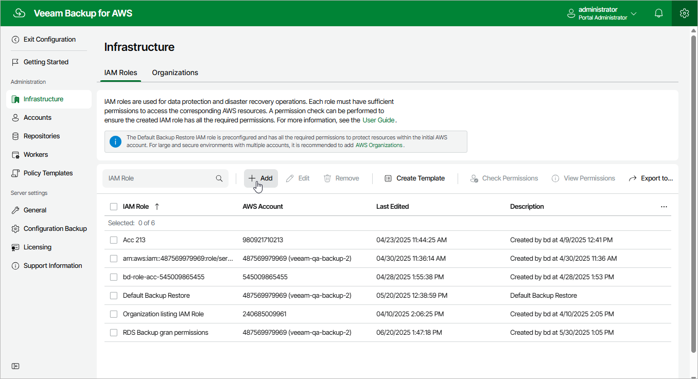

# Step 1. Launch Add IAM Role Wizard

To launch the
Add IAM Role
wizard, do the following:

1. Switch to the
   Configuration
    page.

1. Navigate to
   Infrastructure
    >
    IAM Roles
   .

1. Click
   Add
   .

Page updated 2025-07-04

