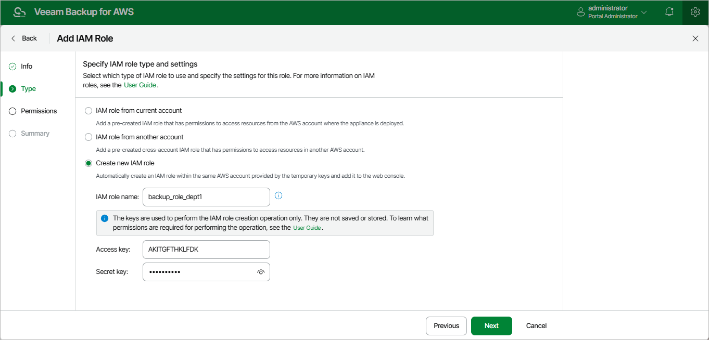

# Specifying Settings for New IAM Role

[This step applies only if you have selected the Create new IAM role option]

At the Type step of the wizard, specify the following settings:

1. In the AWS role name field, specify a name that will be used to create the IAM role in AWS.

Consider the following limitations:

* The specified name must be unique within one AWS account.
* The following characters are not supported: \ / " ' [ ] : | < > ; ? \* & .
* The length of the name must not exceed 63 characters.

For more information on IAM name limitations, see [AWS Documentation](https://docs.aws.amazon.com/IAM/latest/UserGuide/reference_iam-quotas.html).

|  |
| --- |
| Tip |
| If you want to create an IAM role with a path, you must specify the full path and the name of the IAM role. For example, /dept\_1/backup\_role. |

1. Provide one-time access keys of an IAM user that is authorized to create IAM roles in the AWS account.

The specified access keys determine in which AWS account the role will be created. For example, if you specify access keys of an IAM user from the initial AWS account, the IAM role will be created in the initial AWS account.

The IAM user must have the following permissions:

|  |
| --- |
| {     "Version": "2012-10-17",     "Statement": [         {             "Sid": "Statement1",             "Effect": "Allow",             "Action": [                 "iam:AddRoleToInstanceProfile",                 "iam:AttachRolePolicy",                 "iam:CreateInstanceProfile",                 "iam:CreatePolicy",                 "iam:CreatePolicyVersion",                 "iam:CreateRole",                 "iam:DeletePolicyVersion",                 "iam:GetAccountSummary",                 "iam:GetInstanceProfile",                 "iam:GetPolicy",                 "iam:GetPolicyVersion",                 "iam:GetRole",                 "iam:ListAttachedRolePolicies",                 "iam:ListInstanceProfilesForRole",                 "iam:ListPolicyVersions",                 "iam:PassRole",                 "iam:SimulatePrincipalPolicy",                 "iam:UpdateAssumeRolePolicy"             ],             "Resource": [                 "\*"             ]         }     ]  } |

|  |
| --- |
| Note |
| The backup appliance does not store one-time access keys in its configuration database. |

Page updated 2026-05-21

