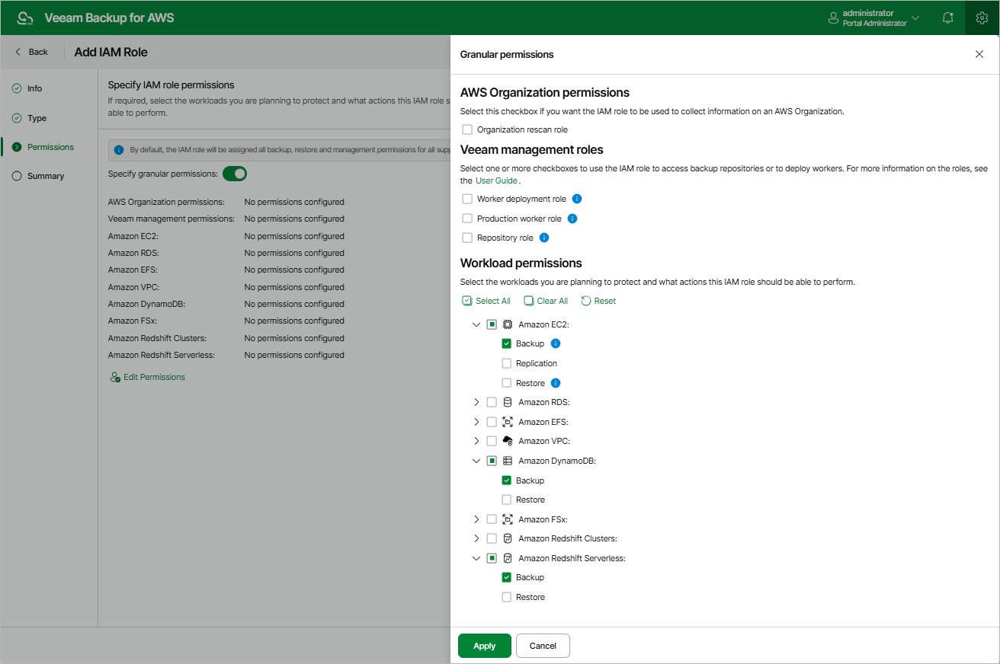

# Step 4. Specify IAM Role Permissions

At the Permissions step of the wizard, you can define specific operations that the backup appliance will be able to perform using the permissions of the created IAM role. Depending on the option that you have selected at the Type step of the wizard, the backup appliance will do either of the following:

* If you have selected the IAM role from current account or the IAM role from another account option, the backup appliance will become able to filter IAM roles and check their permissions in backup and restore settings — but it will not assign any permissions to the role.

In this case, you can grant the permissions to the role manually [using the AWS Management Console](aws_create_iam_policy.md) or instruct the backup appliance to do it, as described in section [Checking IAM Role Permissions](aws_iam_roles_check.md#grant).

* If you have selected the Create new IAM role option, the backup appliance will become able to filter IAM roles and check their permissions in backup and restore settings — and will also assign the specified permissions to the role.

To specify permissions granularly, do the following:

1. Set the Specify granular permissions toggle to On.
2. In the AWS Organization permissions section, select the Organization rescan role check box if you want to add an IAM role whose permissions will be used to collect information on the AWS Organization.

The specified role must be created in the AWS account that manages the AWS Organization that has been added to the backup appliance, as described in section [Adding AWS Organizations](aws_organization_add_settings.md).

1. In the Veeam management roles section, choose actions that will be performed using the IAM role:

* Worker deployment role — will be used to deploy worker instances in the [backup account](aws_worker_options.md#backup). If you choose this action for an IAM role, you will be able to select it [when adding worker configurations](aws_worker_add_config_backup.md).
* Production worker role — will be used to communicate with worker instances in [production accounts](aws_worker_settings.md). If you choose this action for an IAM role, you will be able to select it [when enabling indexing for EFS policies](aws_add_policy_indexing_efs.md), [creating EC2 backup policies](aws_add_policy_target_settings_backups.md#workers), [creating RDS backup policies](aws_add_policy_target_settings_backups_rds.md), [performing entire EC2 instance restore](aws_restore_entire_account.md#workers), [performing EC2 volume-level restore](aws_restore_volume_account.md#workers) or [performing RDS database restore](aws_restore_rds_database_workers.md).
* Repository role — will be used to create new repositories in Amazon S3 buckets and to further access the repositories during data protection and disaster recovery operations. If you choose this action for an IAM role, you will be able to select it [when configuring repository settings](aws_repository_add_folder.md#Role).

|  |
| --- |
| Important |
| For the backup appliance to perform the selected actions using the IAM role, it must be assigned the permissions listed in sections [Worker Deployment Role Permissions in Backup Account](aws_role_permissions_backup_acc.md), [Worker Deployment Role Permissions in Production Accounts](aws_role_permissions_prod_acc.md) and [Repository IAM Permissions](aws_role_permissions_repo.md). |

1. In the Workload permissions section, choose resources that will be protected using the IAM role, and operations that will be performed with these resources:

* Backup — the backup appliance will protect EC2, Redshift, DynamoDB, EFS, FSx and VPC resources. If you select this operation for an IAM role, you will be able to select it in the [EC2 backup](aws_add_policy_scope.md#account), [Redshift backup](aws_add_policy_scope_redshift.md#account), [Redshift Serverless backup](aws_add_policy_scope_redshift_serverless.md#account), [DynamoDB backup](aws_add_policy_scope_dynamo.md#account), [EFS backup](aws_add_policy_scope_efs.md#account), [FSx backup](aws_add_policy_scope_fsx.md#account) and [VPC configuration backup](aws_vpc_policy_regions_manual.md) settings.

Note that the list of permissions for this role will also contain additional permissions required to deploy worker instances in production accounts during EFS indexing and EC2 backup operations.

* Replication — the backup appliance will replicate cloud-native snapshots of EC2 and RDS resources. If you select this operation for an IAM role, you will be able to select it in the [EC2 backup](aws_add_policy_target_settings_replica.md#step2.b) and [RDS backup](aws_add_policy_target_settings_rds_replica.md#step2.b) settings.
* Snapshot — the backup appliance will create cloud-native snapshots of RDS resources. If you select this operation for an IAM role, you will be able to select it in the [RDS backup](aws_add_policy_scope_rds.md#account) settings.

Note that the list of permissions for this role will also contain additional permissions required to deploy worker instances in production accounts during RDS backup operations.

* Restore — the backup appliance will restore EC2, RDS, Redshift, DynamoDB, EFS, FSx and VPC resources. If you select this operation for an IAM role, you will be able to select it when performing [entire EC2 instance restore](aws_restore_entire_account.md), [EC2 volume-level restore](aws_restore_volume_account.md), [EC2 file-level recovery](aws_restore_item_account_efs.md), [RDS restore](aws_restore_rds_account.md), [Redshift restore](aws_restore_account_redshift.md), [Redshift Serverless restore](aws_restore_account_redshift_serverless.md), [DynamoDB restore](aws_restore_account_dynamo.md), [EFS restore](aws_restore_entire_account_efs.md), [FSx restore](aws_restore_account_fsx.md), [entire VPC configuration restore](aws_restore_entire_vpc_account.md) and [selected VPC items restore](aws_restore_items_vpc_account.md).

Note that the list of permissions for this role will also contain additional permissions required to deploy worker instances in production accounts during EC2 and RDS restore operations.

|  |
| --- |
| Important |
| For the backup appliance to perform the selected operations using the IAM role, it must be assigned the permissions listed in sections [Backup IAM Permissions](aws_role_permissions_backup.md) and [Restore IAM Permissions](aws_role_permissions_restore.md). |

Note that if you do not specify any management roles and resource permissions for the IAM role at this step, all the listed actions and resource operations will be selected for the role automatically.

Page updated 2026-05-22

