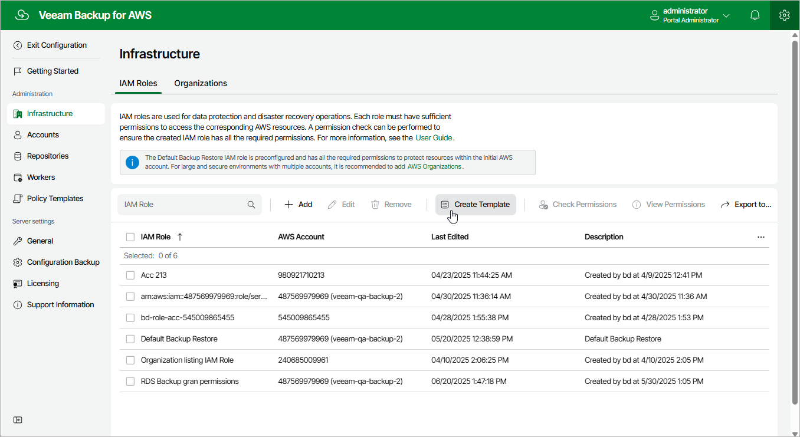

# Step 1. Launch Create Template Wizard

To launch the
Create IAM Role Template
wizard, do the following:

1. Switch to the
   Configuration
    page.

1. Navigate to
   Infrastructure
    >
    IAM Roles
   .

1. Click
   Create Template
   .

Page updated 2025-07-04

