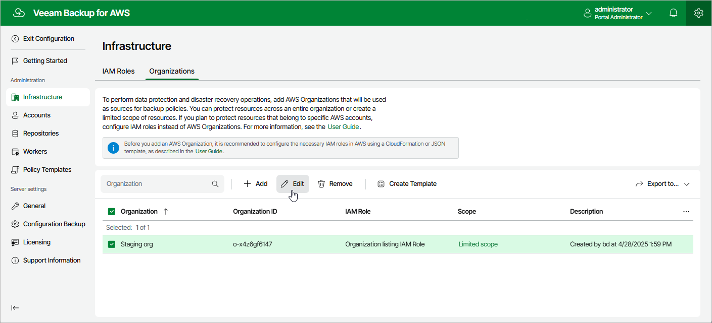

# Editing Organization Settings

For each AWS Organization added to the backup appliance, you can modify settings configured while adding the organization:

1. Switch to the Configuration page.

1. Navigate to Infrastructure > Organizations.

1. Select the AWS Organization and click Edit.

1. Complete the Edit Organization wizard.

1. To provide a new name and description for the AWS Organization, follow the instructions provided in section [Adding Organizations](aws_organization_add_name.md) (step 2).
2. To edit the IAM roles, follow the instructions provided in section [Adding Organizations](aws_organization_add_settings.md) (step 3).
3. To edit the limited scope of organizational units, navigate to the Scope step and click Edit. Then, follow the instructions provided in section [Adding Organizations](aws_organization_add_scope.md) (step 4).

Note that you cannot remove a limited scope of organizational units that are specified in the settings of any configured backup policy.

1. At the Summary step of the wizard, review summary information and click Finish to confirm the changes.

Page updated 2026-05-20

