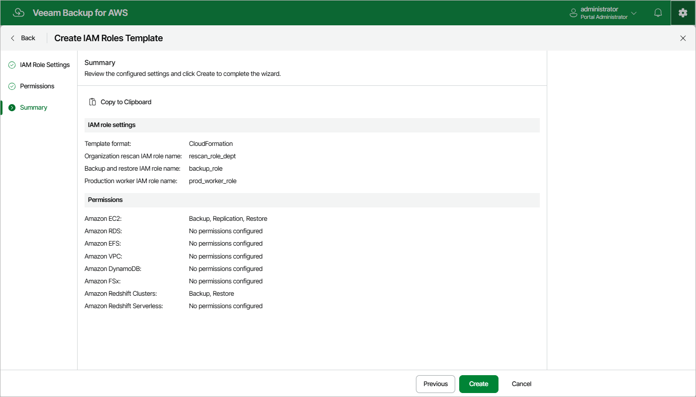

# Step 4. Finish Working with Wizard

At the Summary step of the wizard, review configuration information. After you click Create, the backup appliance will generate a separate .CFORM or a .JSON file for each specified IAM role (depending on the settings configured at [step 2](aws_organization_template_add_name.md) of the wizard) and save it locally in the default download folder.

Page updated 2026-05-20

