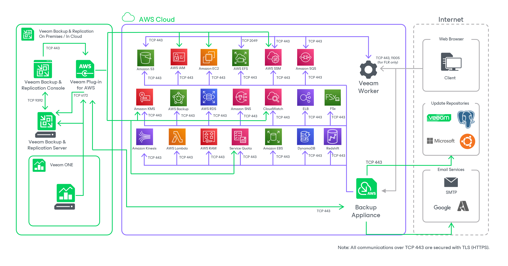

# Solution Architecture

Since Veeam Plug-in for AWS is integrated with Veeam Backup & Replication, the solution architecture comprises the following set of components:

* [Backup server](aws_backup_server.md)
* [AWS Plug-in for Veeam Backup & Replication](aws_plugin.md)
* [Backup appliances](aws_backup_appliances.md)
* [Backup repositories](aws_backup_repositories.md)

* [Worker instances](aws_worker_instances.md)
* [Additional repositories and tape devices](aws_additional_repos_and_tape_devices.md#tape_devices)
* [Gateway servers](aws_gateway_servers.md)
* [Mount servers](aws_mount_servers.md)

Page updated 2026-05-19

