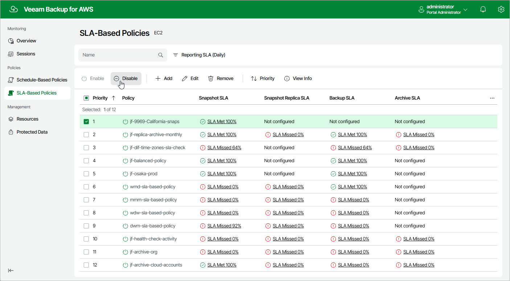

# Disabling and Enabling Policies

By default, the backup appliance runs all created backup policies according to the specified schedules. However, you can temporarily disable a backup policy so that the backup appliance does not run the backup policy automatically. You will still be able to [manually start](aws_policies_start_stop.md) or enable the disabled backup policy at any time you need.

To disable or enable a backup policy, do the following:

1. Navigate to Policies.
2. Switch to the necessary tab and select the backup policy.

1. Click Disable or Enable.

|  |
| --- |
| Note |
| Disabling a backup policy does not affect the retention settings configured for the cloud-native snapshots, image-level and archived backups created by the policy. The backup appliance will continue running retention sessions for the disabled backup policy and removing restore points according to the configured settings. |

Page updated 2026-06-17

