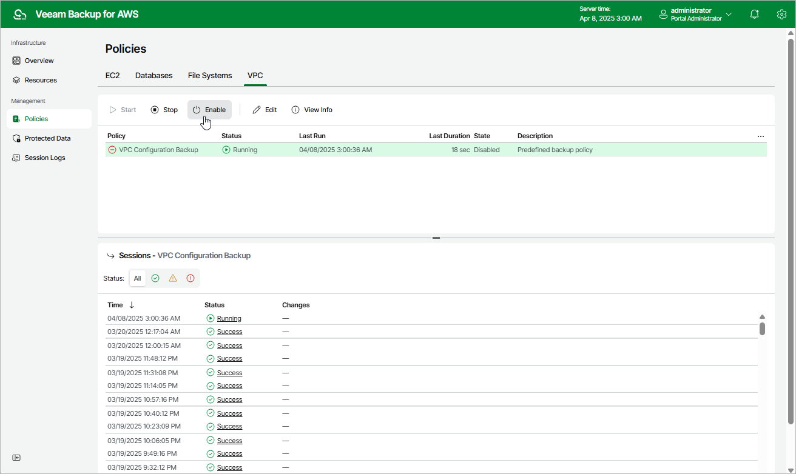

# Enabling and Disabling VPC Configuration Backup Policy

By default, the backup appliance comes with the disabled VPC Configuration Backup Policy. You can [manually start](aws_policies_start_stop_vpc.md) or enable the disabled backup policy at any time you need.

To enable or disable the VPC Configuration Backup policy, do the following:

1. Navigate to Policies > VPC.
2. Click Enable or Disable.

Page updated 2026-05-21

