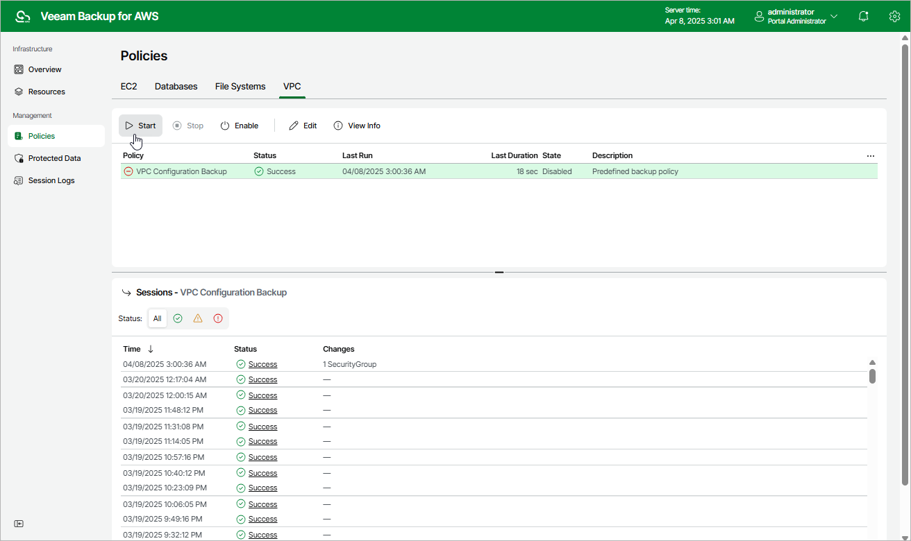

# Starting and Stopping VPC Configuration Backup Policy

You can start the VPC Configuration Backup policy manually, for example, if you want to create an additional restore point in the backup chain and do not want to modify the configured backup policy schedule. You can also stop a backup policy if the backup process is about to take long, and you do not want the policy to have an impact on the production environment during business hours.

To start or stop a backup policy, do the following:

1. Navigate to
   Policies
    >
    VPC
   .
2. Click
   Start
    or
   Stop
   .

Page updated 2025-04-07

