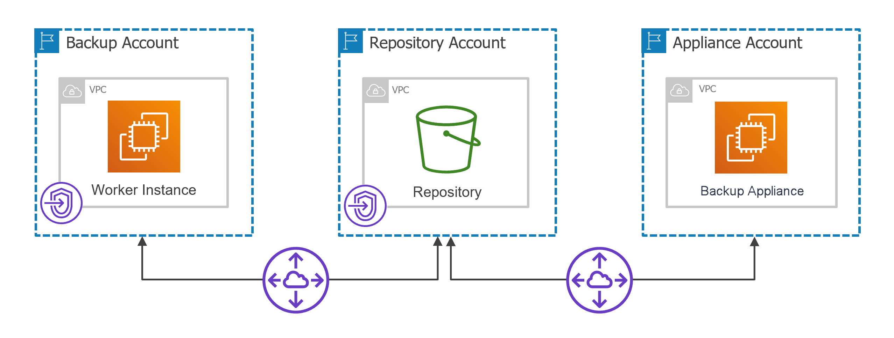

# Configuring Private Networks for Backup Account

For backup appliances to be able to deploy worker instances in a private environment in the [backup account](aws_worker_options.md#backup), perform the following steps:

1. [Create VPC interface and S3 interface endpoints for subnets to which worker instances will be connected](aws_create_interface_endpoints.md).
2. [Create a peering connection between VPCs](aws_create_vpc_peering_connection.md).
3. [Add routes to the route tables associated with the subnets of the VPCs](aws_configure_routing_network.md).

Page updated 2026-07-15

