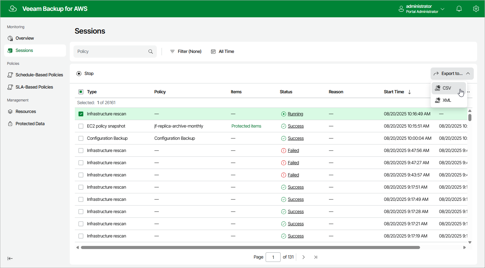

# Collecting Object Properties

You can export properties of objects managed by backup appliances as a single file in the CSV or XML format. To do that, in the backup appliance Web UI, navigate to the necessary tab and click Export to. The backup appliance will save the file with the exported data to the default download directory on the local machine.

|  |
| --- |
| Note |
| Even if you try to export properties of a specific object, a backup appliance will still export all properties of all objects present on the currently opened tab. |

Page updated 2026-05-21

