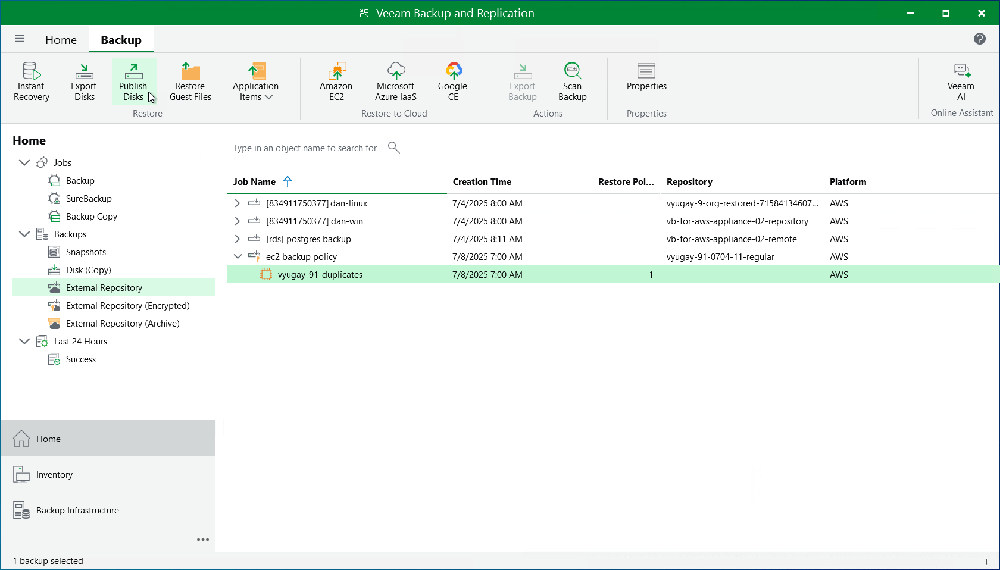

# Publishing Disks

Veeam Backup & Replication allows you to publish point-in-time disks, that is, to mount specific EBS volumes of backed-up EC2 instances to any server to instantly access data in the read-only mode. You can copy the necessary files and folders to the target server, and perform an antivirus scan of the backed-up data. For more information, see [Disk Publishing (Data Integration API)](data_integration_api.md).

|  |
| --- |
| Important |
| Disk publishing can be performed only using either of the following backups:   * Backup files stored in standard backup repositories for which you have specified access keys of an IAM user whose permissions are used to access the repositories. To learn how to specify credentials for the repositories, see sections [Creating New Repositories](aws_add_s3_account.md) and [Connecting to Existing Appliances](aws_connect_appliance_repo.md). * Backup files stored in storage vaults for which you have registered the backup server in Veeam Data Cloud and assigned the storage vault to this backup server. To learn how to register a backup server in Veeam Data Cloud Vault and assign storage vaults, see sections [Adding Storage Vaults Using Console](aws_add_vault_account.md) and [Connecting to Existing Appliances](aws_connect_appliance_repo.md). |

To publish volumes of an EC2 instance, do the following:

1. In the Veeam Backup & Replication console, open the Home view.
2. Navigate to Backups > External Repository.
3. Expand the necessary backup policy, select the EC2 instance whose volumes you want to publish and click Publish Disks on the ribbon.
4. Complete the Publish Disks wizard as described in section [Publishing Disks](disk_export_machine.md).

Page updated 2026-06-25

