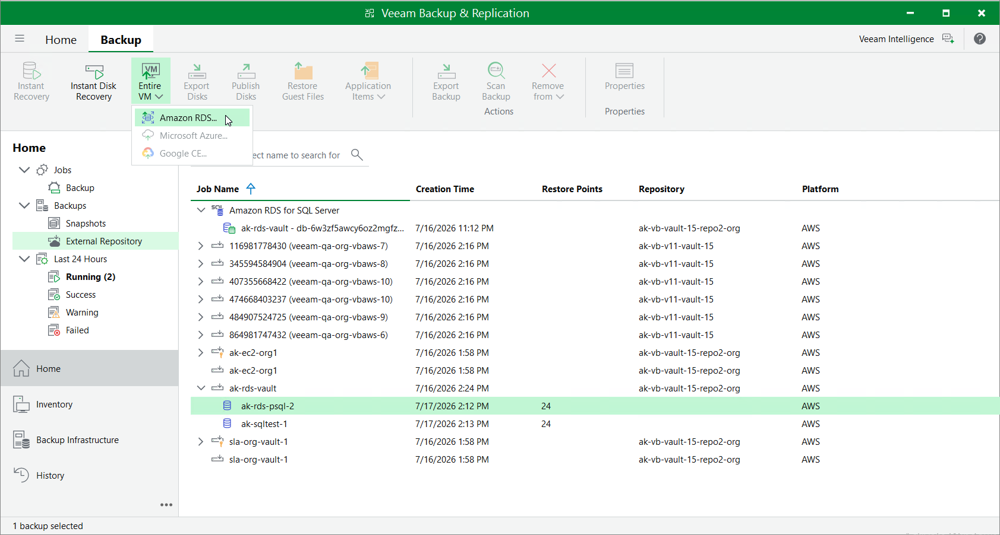

# Restoring RDS Databases

You can recover corrupted databases of a DB instance running the Microsoft SQL Server or PostgreSQL database engine from an image-level backup either using the backup appliance Web UI or Veeam Explorer for Microsoft SQL Server.

Restoring RDS Databases Using Web UI

To recover corrupted databases of a DB instance, do the following:

1. In the Veeam Backup & Replication console, open the Home view.
2. Navigate to Backups > External Repository.
3. Expand the backup policy that protects the database you want to recover, select the necessary database and click Entire VM > Amazon RDS on the ribbon.

Alternatively, you can right-click the selected database and click Entire VM > Amazon RDS.

Veeam Backup & Replication will open the RDS Database Restore wizard in a web browser. Complete the wizard as described in section [Performing Database Restore](aws_performing_rds_database_restore.md).

Restoring RDS Databases Using Veeam Explorer for Microsoft SQL Server

To recover corrupted databases of a DB instance, do the following:

|  |
| --- |
| Important |
| Database restore with Veeam Explorer for Microsoft SQL Server can be performed only using either of the following backups:   * Backup files stored in standard backup repositories for which you have specified access keys of an IAM user whose permissions are used to access the repositories. To learn how to specify credentials for the repositories, see sections [Creating New Repositories](aws_add_s3_account.md) and [Connecting to Existing Appliances](aws_connect_appliance_repo.md). * Backup files stored in storage vaults for which you have registered the backup server in Veeam Data Cloud and assigned the storage vault to this backup server. To learn how to register a backup server in Veeam Data Cloud Vault and assign storage vaults, see sections [Adding Storage Vaults Using Console](aws_add_vault_account.md) and [Connecting to Existing Appliances](aws_connect_appliance_repo.md). |

1. In the Veeam Backup & Replication console, open the Home view.
2. Navigate to Backups > External Repository.
3. Expand the Amazon RDS for SQL Server node, select the necessary database and click Amazon RDS for SQL Server on the ribbon.

Alternatively, you can right-click the selected database and click Restore from an Amazon RDS for SQL Server backup.

Veeam Backup & Replication will open the Veeam Explorer for Microsoft SQL Server application. In the application, follow the instructions provided in section [Restoring from RDS Backups](vesql_restore_rds.md).

Page updated 2026-07-31

