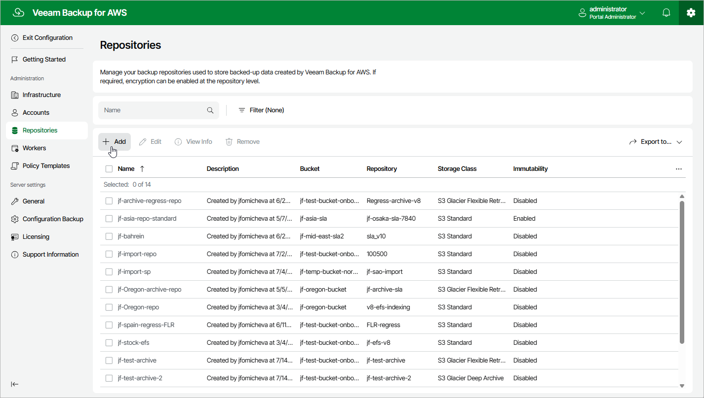

# Step 1. Launch Add Repository Wizard

To launch the
Add Repository
wizard, do the following:

1. Switch to the
   Configuration
    page.

1. Navigate to
   Repositories
   .

1. Click
   Add
   .

Page updated 2025-08-20

