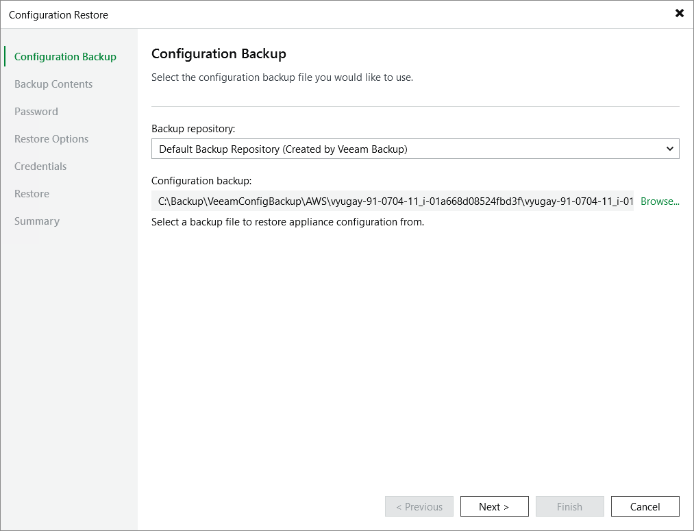

# Step 2. Choose Backup File

At the Configuration Backup step of the wizard, do the following:

1. From the Backup repository list, select a repository where the configuration backup file is stored.

For a repository to be displayed in the list of available repositories, it must be added to the backup infrastructure as described in section [Adding Backup Repositories](repo_add.md).

1. Click Browse and select the necessary file.

If the selected configuration backup file is not stored on the backup server, Veeam Backup & Replication will copy the file to a temporary folder on the server and automatically delete it from the folder as soon as the restore process completes.

|  |
| --- |
| Important |
| [Applies only if you restore the configuration to another backup appliance] If the selected backup contains storage vaults from the initial backup appliance, the new backup appliance will not be able to access these vaults due to an Impersonation IAM role mismatch. As a result, backup policies, restore operations and retention tasks that require access to these vaults will fail. To work around the issue, [remove the storage vaults](aws_repositories_remove.md#remove_repo_from_web_ui) from the backup appliance and [add them again](aws_repositories_add_vault_console.md) using the Veeam Backup & Replication console. |

Page updated 2026-07-09

