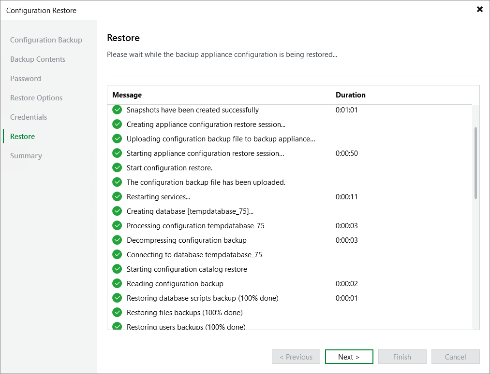

# Step 7. Track Progress

Veeam Backup & Replication
will display the results of every step performed while executing the configuration restore. At the
Restore
step of the wizard, wait for the restore process to complete and click
Next
.

Page updated 2025-09-02

