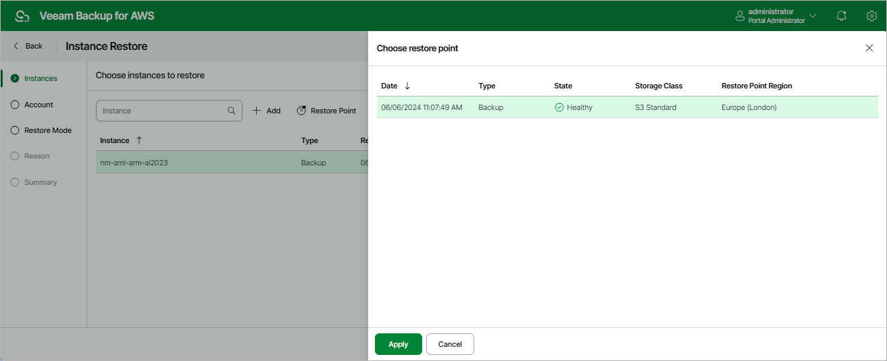

# Step 2. Select Restore Point

At the Instances step of the wizard, you can add EC2 instances to the restore session and select restore points to be used to perform the restore operation for each added instance. By default, the backup appliance uses the most recent valid restore point. However, you can restore an EC2 instance to an earlier state.

|  |
| --- |
| Important |
| If you select a restore point stored in an archive backup repository and the same restore point is also available in a standard backup repository, Veeam Backup for AWS will display the Confirmation Restore window. To proceed, choose whether you want to use the archived or standard restore point to perform the restore operation. |

To select a restore point:

1. Select the EC2 instance and click Restore Point.
2. In the Choose restore point window, select the necessary restore point and click Apply.

To help you choose a restore point, the backup appliance provides the following information on each available restore point:

* Date — the date when the restore point was created.
* Type — the type of the restore point:

* Snapshot — a cloud-native snapshot created by a backup policy.
* Replica — a snapshot replica created by a backup policy.
* Manual Snapshot — a cloud-native snapshot created manually.
* Backup — an image-level backup created by a backup policy.
* Archive — an archived backup created by a backup policy.

* State — the state of the restore point (for image-level backups):

* Healthy — the restore point has been verified by the health check session and reported to be healthy.
* Incomplete — the restore point has been verified by the health check session and reported to be corrupted or incomplete.

* Storage Class — a storage class of the backup repository where the restore point is stored (for image-level backups).
* Restore Point Region — an AWS Region where the restore point is stored.
* Account — an AWS account where the restore point is stored.

Page updated 2026-05-22

