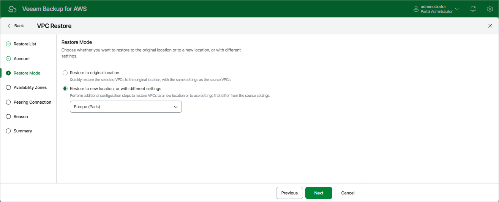

# Step 4. Choose Restore Mode

At the Restore Mode step of the wizard, choose whether you want to restore the selected VPC configuration to the original or to a custom location. If you select the Restore to new location, or with different settings option, specify the target AWS Region where to restore the VPC configuration.

|  |
| --- |
| Important |
| If you select the Restore to a new location, or with different settings option, consider that AWS Regions have different lists of the supported AWS services. VPC endpoints created using an AWS service that is not available in the target AWS Region will not be restored. |

Page updated 2026-05-22

