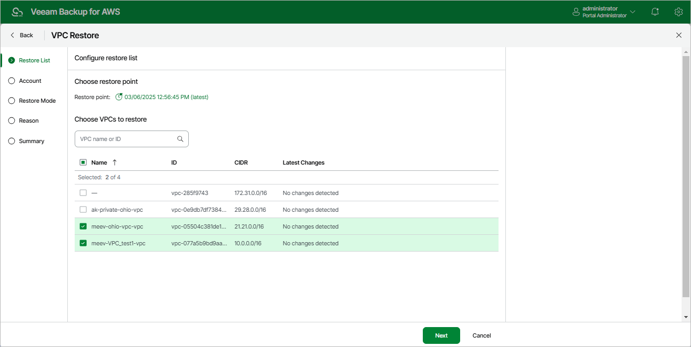

# Step 2. Select Restore Point

At the Restore List step of the wizard, select a restore point that will be used to restore the selected VPC configuration. By default, the backup appliance uses the most recent valid restore point. However, you can restore the VPC configuration data to an earlier state.

To select a restore point, do the following:

1. In the Choose restore point section, click the link next to the Restore point field.
2. In the Available restore points window, select the necessary restore point and click Apply.
3. In the Choose VPCs to restore section, select VPCs whose configuration you want to restore.

Page updated 2026-05-22

