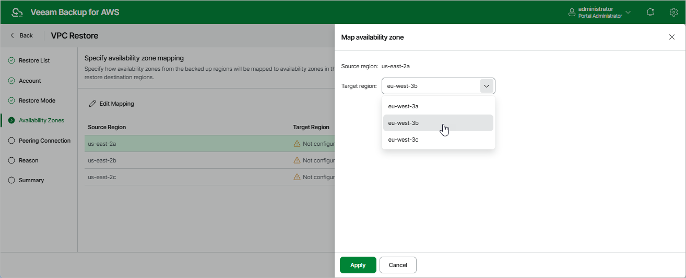

# Step 5. Configure Availability Zone Mapping

[This step applies only if you have selected the Restore to new location, or with different settings option at the Restore Mode step of the wizard]

At the Availability Zones step of the wizard, for each source Availability Zone, choose an Availability Zone in the target AWS Region to which VPC configuration items of the source Availability Zone will be restored:

1. Choose an Availability Zone from the list and click Edit Mapping.
2. In the Map availability zone window, select the target Availability Zone from the Target region drop-down list.
3. Click Apply.

|  |
| --- |
| Important |
| The source and target AWS Regions may have different number of Availability Zones. In this case, the backup appliance will automatically change subnet configuration for transit gateway VPC attachments, VPC endpoints and load balancers. After restoring, you can modify the subnet configuration manually in the AWS Management Console. To learn how to modify subnet configuration for VPC networking components, see [AWS Documentation](https://docs.aws.amazon.com/vpc/latest/userguide/VPC_Networking.html). |

Page updated 2026-05-22

