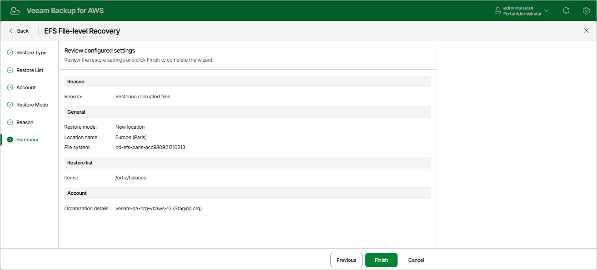

# Step 7. Finish Working with Wizard

At the Summary step of the wizard, review summary information and click Finish.

[Applies only if you have selected the Browse files option at the Restore Type step of the wizard] As soon as you click Finish, the backup appliance will close the EFS File-level Recovery wizard, start a recovery session and display the FLR Running Sessions window. To select file and folders that you want to recover, follow the instructions provided in steps 8-10.

Page updated 2026-05-22

