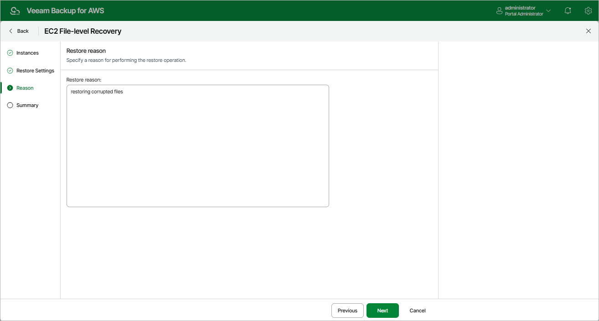

# Step 4. Specify Restore Reason

At the
Reason
step of the wizard, you can specify a reason for recovering files and folders. This information will be saved to the session history and you will be able to reference it later.

Page updated 2025-09-29

