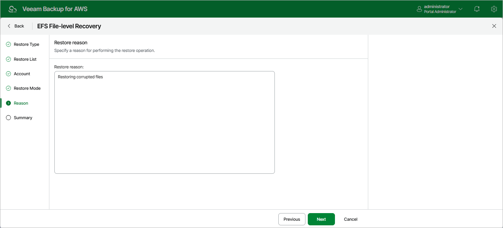

# Step 6. Specify Restore Reason

At the
Reason
step of the wizard, you can specify a reason for restoring the files and folders. The information you provide will be saved in the session history and you can reference it later.

Page updated 2025-10-02

