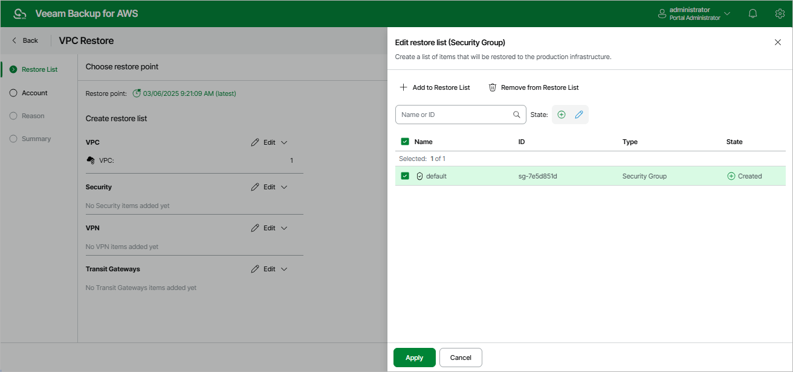

# Step 2. Select Restore Point and Items to Restore

At the Restore List step of the wizard, select VPC configuration items you want to restore and a restore point that will be used to restore the selected items. By default, the backup appliance uses the most recent valid restore point. However, you can restore the VPC configuration data to an earlier state.

1. To select the restore point:

1. In the Choose restore point section, click the link next to the Restore point field.
2. In the Available restore points window, select the necessary restore point and click Apply.

1. To select the VPC configuration items:

1. In the Create restore list section, click Edit and select an Amazon VPC resource that you want to restore.
2. In the Edit restore list window, click Add to Restore List.
3. In the Item List window, select check boxes next to the items that you want to restore, and click Add.
4. In the Edit restore list window, review the restore list and click Apply.

Page updated 2026-05-22

