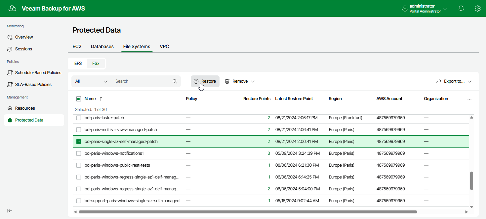

# Step 1. Launch FSx Restore Wizard

To launch the FSx Restore wizard, do the following:

1. Navigate to Protected Data > File Systems > FSx.

1. Select the FSx file system that you want to restore.
2. Click Restore.

Alternatively, click the link in the Restore Points column. Then, in the Available Restore Points window, select the necessary restore point and click Restore.

|  |
| --- |
| Note |
| You can restore multiple FSx file systems if they belong to same AWS account only. |

Page updated 2026-05-22

