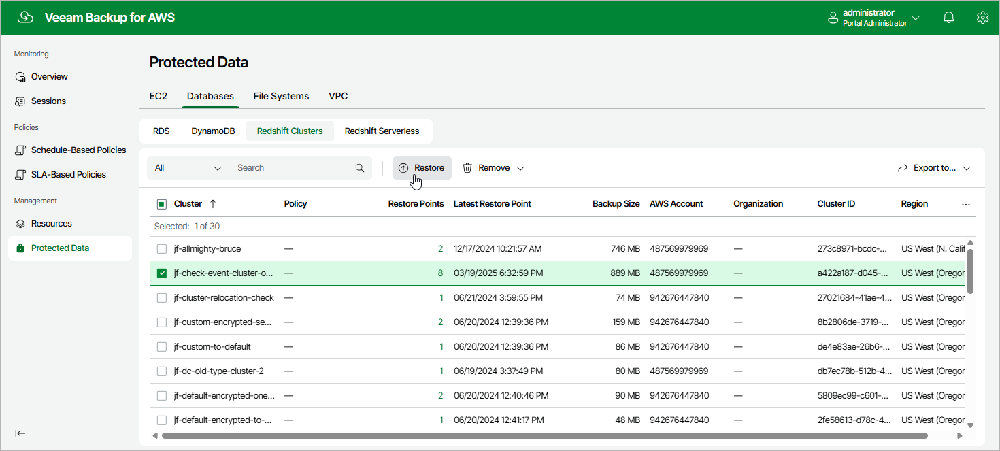

# Step 1. Launch Redshift Restore Wizard

To launch the Redshift Cluster Restore wizard, do the following:

1. Navigate to Protected Data > Databases > Redshift.

1. Select the Redshift cluster that you want to restore.
2. Click Restore.

Alternatively, click the link in the Restore Points column. Then, in the Available Restore Points window, select the necessary restore point and click Restore.

|  |
| --- |
| Note |
| You can restore multiple Redshift clusters if they belong to same AWS account only. |

Page updated 2026-05-22

